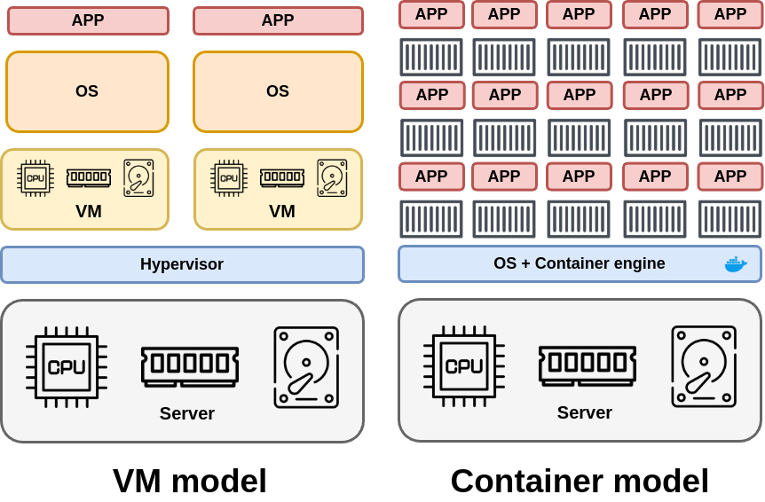
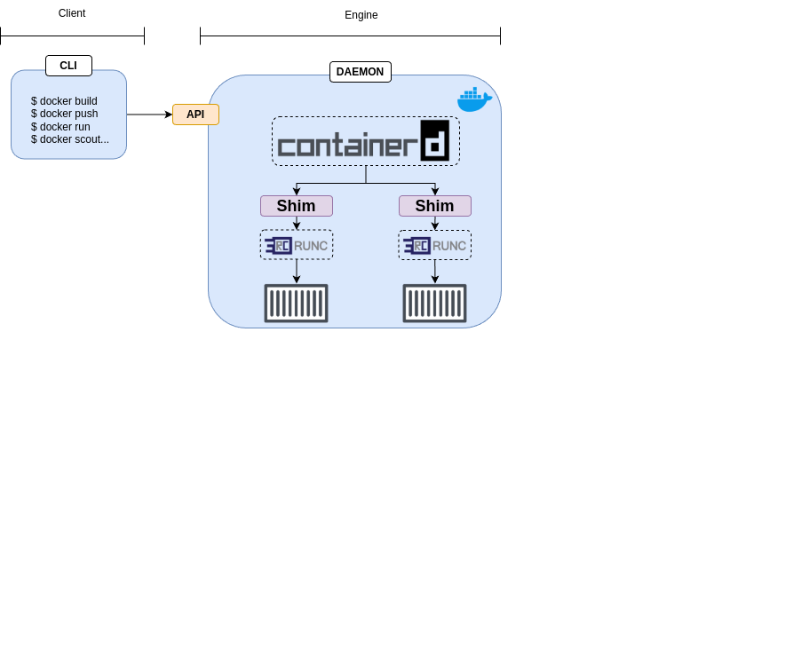
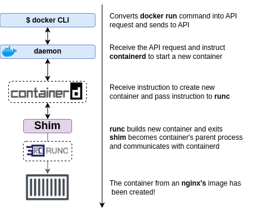
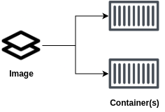
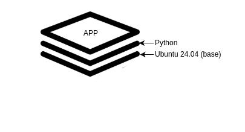
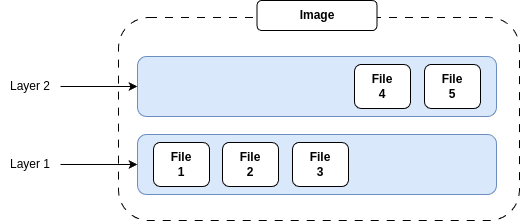
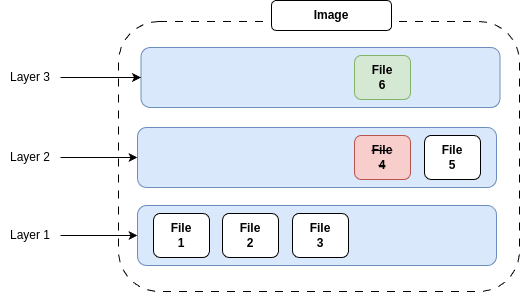
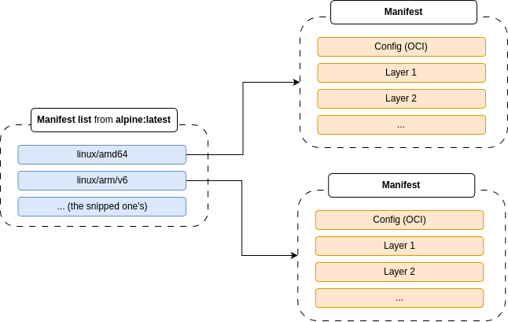
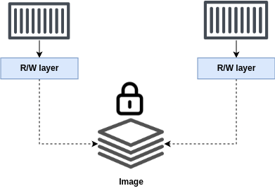

---

## Containers vs VMs

Containers and VMs are both virtualization technologies for running applications. However, the ways they virtualize are very different:

- __VMs__: Virtualize hardware
- __Containers__: Virtualize OS

In the VM model, you power on a server and a hypervisor boots. When the hypervisor boots, it claims all hardware resources such as CPU, RAM, storage, and network adapters. To deploy an app, you ask the hypervisor to create a virtual machine.

It does this by carving up the hardware resources into virtual versions, such as:
- Virtual CPUs
- Virtual Ram

It packages all them into a VM that looks exactly like a physical server. Once you have the VM, you install an OS and then an app.

In the container model, you power on the same server and an OS boots and claims all hardware resources. You then install a container engine such as Docker. To deploy an app you ask Docker to create a container. It does this by carving up OS resources such as process trees and filesystems into virtual versions and then packaging them as a container that looks exactly like a regular OS.

You then tell Docker to run the app in the container.



> VM Tax, one of the biggest problems with the virtual machine model is that you need to install an OS on every VM - every OS consumes CPU, RAM, and storage and take a relative long time to boot. __Containers get around all of this by sharing a single OS on the host they're running on__.

## Theory

Docker Engine is a jargon for the server-side components of Docker that run and manage containers. If you've ever worked with VMware, the Docker Engine is similar to ESXi.

The Docker Engine is modular and built from many small specialized components pulled from projects such as the OCI, the CNCF, and the Moby project.

At high level, there are two majors parts to the Docker platform:
- __The CLI (client)__: The CLI is the familiar docker command-line tool for deploying and managing containers. It converts simple commands into API request and sends them to the engine.
- __The engine (server)__: Comprises all the service-side components that run and manage containers.

- 

From the image, and making more focus on the docker engine we can detect the following components:
- __containerd__: Lifecycle management from all containers created 
- __shim__: Its the process that will report the status of the container created
- __runc__: Interface with the kernel and run the container at low-level runtime

> All these tools where created by stripping the original daemon 

---

## Running a container

Now that you have a view of the big picture, let's see how to use Docker to create a new container.

This can be made using this command:
```bash
docker run -d --name host nginx
```

To see all the containers that you're running it can be used the command `docker ps`.

This is what we seen after starting the nginx host:
```bash
docker ps
CONTAINER ID   IMAGE     COMMAND                  CREATED              STATUS              PORTS     NAMES
fa4432bb65bd   nginx     "/docker-entrypoint.…"   About a minute ago   Up About a minute   80/tcp    host
```

### Going back to the theory

When you run commands like this, the Docker client converts them into API requests and sends them to the API exposed by the daemon.

The daemon can expose the API on a local socket or over the network.
- `LINUX`: The socket is in `/var/run/docker.sock` 
- `WINDOWS`: The socket is in `\pipe\docker_engine`

> When using Linux, sometimes, we have to give privileges to that socket to allow the sending of request by the docker engine. This is why, in some distros, we have to execute the command `sudo chmod 666 /var/run/docker.sock` to allow the use of docker in the current computer.

The daemon receives the request, interprets it as a request to create a new container and passes it to containerd. Remember that the daemon doesn't contain any code to create containers. __runc interface with the OS kernel to bull together all the constructs necessary to create a container__. The container is stared as a child process of runc, and __as soon as the container starts, runc exits__.

This can be summarized with the following image:
- 

Decoupling the container creation and management from the Docker daemon and implementing it in containerd and runc makes it possible to stop, restart, and even update the daemon without impacting running containers.

In linux all the binaries of each component explained before are here:
- `/usr/bin/dockerd`: The daemon from docker
- `/usr/bin/containerd`: containerd
- `/usr/bin/containerd-shim-runc-v2`: The plugging used to connect container with runc (shim)
- `/usr/bin/runc`: runc

---

## Working with images

Before getting started, all of the following terms mean the same thing, and we'll use them interchangeably: _Image_, _Docker image_, _container image_, and _OCI image_.

An image is a read-only package containing everything you need to run an application This means they include application code, dependencies, a minimal set of OS constructs and metadata. __You can start multiple containers from a single image__.

Images are like classes. You can create one or more objects from a class, whereas you can create one or more containers from an image. 

The easiest way to get an image is to pull one from a registry. [Docker Hub](https://hub.docker.com/) is the most common registry, and pulling an image downloads it to your local machine where Docker can use it to start one or more containers. Other registries exist, and Docker works with them all.

### Getting more deep into images

Images are made by stacking independent _layers_ and __representing them as a single unified object__. One layer might have the OS components, another layer might have application dependencies, and other layer might have the application. __Docker stacks these layers and makes them look like a unified system__.

> Linux images are usually small (NGINX 60MB and redis around 40MB), however, Windows images can be more huge.

We 've already said that images are like stopped containers. You can even stop a container and create a new one from it. With this in mind, images are `build-time` (static blueprint containing the app) constructs, whereas containers are `run-time` (active instances of the image) constructs.

- 

Containers are designed to run a single application or microservice. As such, they should only contain application code and dependencies. You should not include nonessentials such as build tools or troubleshooting tools.

### Pulling images

A clean Docker installation has an empty _local repository_. _Local repository_ is jargon for an area on your local machine where docker stores images for more convenient access. We sometimes call it the image cache, and on Linux its usually located in `/var/lib/docker/<storage-driver>`.

The mentioned local repository can be seen with the following command:
```bash
docker images
REPOSITORY                    TAG              IMAGE ID       CREATED        SIZE
nginx                         latest           9d6b58feebd2   3 weeks ago    279MB
```

The process of getting images is called _pulling_.

For example, run this command to pull the redis image:

```bash
docker pull redis
Using default tag: latest
latest: Pulling from library/redis
c8c62be273bb: Download complete 
40836d0aa8f0: Download complete 
7cf63256a31a: Downloading [==============>                                    ]  8.389MB/28.22MB
056ff5d77b71: Download complete 
fc690ecf94f9: Download complete 
4f4fb700ef54: Download complete 
d6c5e428cfd7: Download complete 
a37a0a824c7e: Downloading [==================================>                ]  10.49MB/15.33MB
```

Each of these hashes are referencing concrete image layers needed to run the complete image.

In the last snipped you can se that only 2 layers are been downloaded.

This occurs because the daemon will download only those layers that are needed to run the redis image. This means that an if an image from the local registry already has one or more layers from redis, those layers won't be download.

#### Docker opinionated

When pulling images from docker the engine states by default the following concepts:
- That you want to download the latest version of the image
- That you want to download it from DockerHub

### Image registries

As told in the [beginning](#working-with-images) of the chapter. Images from docker can be obtained from registries.

The most popular one is Docker Hub but there are others like `Azure Container registry` or `Amazon elastic container registry`.

#### Image naming, tagging and unofficial registries

Most of the time, you'll work with images based on their name, and you can learn a lot about an image from its fully qualified image name.

For example a fully qualified image name it will be: __docker.io/joeyratt/summary-docker/dummy-web.1__

This image can be split it in this sections:
- `docker.io`: Registry (in this case its the DockerHub)
- `joeyratt`: Owner of the account where the repository exist
- `summary-docker`: Repository
- `dummy`-web: Image
- `1`: Tag

When we run or pull the images from `nginx` or `redis` we have retrieved from official repositories. Because of that we haven't to specify its registry or owner.

This doesn't happen with the _unofficial repositories_. Like the `regsync` case from who anyone who wants to pull one of his images it will have to set the full name:

```bash
docker pull ghcr.io/regclient/regsync:latest
latest: Pulling from regclient/regsync
9099eeb20b3a: Download complete 
200affa550bf: Download complete 
Digest: sha256:b3f8b2b8a0a61a96b6d1ed3c6f2ef361819d8508de32ddccb3e89f6500c2a685
Status: Downloaded newer image for ghcr.io/regclient/regsync:latest
ghcr.io/regclient/regsync:latest
```

> As you can see the daemon has been able to pull the image without having any issue. This is because the registry GHCR supports the OCI registry-spec we have told before. 

#### Images with multiple tags

You can give a single image as many tags you want.

At first glance the following output might look like it's listing 4 images. However on closer inspection it's just 2 - the `6aafb7f25fc9` image is tagged as `latest` and `7.4.2-bookworm`.

```bash
docker images
REPOSITORY   TAG                  IMAGE ID       CREATED       SIZE
redis        8.0-M03-bookworm     a16692599731   5 weeks ago   193MB
redis        8.0-M03-alpine3.21   4a0d728f38c4   5 weeks ago   89MB
redis        7.4.2-bookworm       6aafb7f25fc9   7 weeks ago   173MB
redis        latest               6aafb7f25fc9   7 weeks ago   173MB
```

Even so, if you inspect more closure you will see that the version 7 has the latest tag and not the 8 version. This also implies that the newest image in the repo it doesn't have to have the latest tag.

Also take into account that if a tag of an existing image in the registry is pushed again to the same registry that tag will be moved to the newer image.

This means that if an image is patched and deployed again with the same tag the newer users will download the newer version (but the older users will have to use --digest to know if they are using the image with the error or not)

### Image and layers 

As it has been stated before. Images are formed by layers and these can be identified with an unique hash. This hash gives an unique identification of it.

> An image has its own hash and layers too!

Layers can be expected using the following commands:
- `docker images --digest {image_name}`: Gives the hash of an image
- `docker inspect`: Shows each of the layers than an image has
- `docker history`: Shows the history of a build image


### Adding layers

All docker images start with a __base layer__, and every time you add new content, Docker adds a new layer.

Consider the following oversimplified example of building a simple Python application. Your corporate policy mandates all applications bo built on top of the official Ubuntu 24:04 image. This means the official Ubuntu 24:04 image will be the base layer for this app. Installing Python will add a second layer, and your application source code will add a third. The final image will have three layers, as shown in the following image.

- 

> Remember that this is an oversimplified example

Its important to understand that an image is the combination of all layers stacked in the order they were built.

- 

Its important to note also that an image and layers and independent. This means that they are stored as independent objects. __The image is just metadata identifying the required layers and explaining how to stack them__.

If a new layer is been added into the last image and this layer edits a file from other layers this one will override it.

- 

---

## Multi-architecture images

As we known docker works with the running kernel to interact with the computer. This means that a docker image build in a ADM64 machine will get an image for an ADM64. This same image won't work in other machines that aren't the one stated.

Taking this in mind we can confirm that for the same image it will be multiple builds for each architecture that will use it (ARM, ADM, etc...).

Docker to obfuscate this complexity in its registry API. The registry became clever enough to hide images from multiple architectures behind a single tag. This means you can do a `docker pull alpine` on any architecture and get the correct version of the image.

To make this happen the registry API supports two important constructs:
- __Manifest list__: List all architectures supported by an image tag
- __Manifest__: For the given architecture, list all the layers it needs to run the concrete image

This can be seen using the `buildx` command:

```bash
docker buildx imagetools inspect alpine
Name:      docker.io/library/alpine:latest
MediaType: application/vnd.oci.image.index.v1+json
Digest:    sha256:a8560b36e8b8210634f77d9f7f9efd7ffa463e380b75e2e74aff4511df3ef88c

Manifests: 
  Name:        docker.io/library/alpine:latest@sha256:1c4eef651f65e2f7daee7ee785882ac164b02b78fb74503052a26dc061c90474
  MediaType:   application/vnd.oci.image.manifest.v1+json
  Platform:    linux/amd64
<...>          
  Name:        docker.io/library/alpine:latest@sha256:903bfe2ae9942c3e1520ef3b4085d3ed0ae7aa04d5b084a6b5f20c3a2bf54d37
  MediaType:   application/vnd.oci.image.manifest.v1+json
  Platform:    linux/arm/v6
<...>
```

From this output we can guess the following:

- 

The command `inspect` also helps you to see all the architectures supported by a concrete image.

Lets list the manifest list of the alpine image but with inspect (and using grep to just get what we really want):

```bash
docker manifest inspect alpine | grep 'architecture\|os'
            "architecture": "amd64",
            "os": "linux"
            "architecture": "unknown",
            "os": "unknown"
            "architecture": "arm",
            "os": "linux",
            "architecture": "unknown",
            "os": "unknown"
            "architecture": "arm",
            "os": "linux",
            "architecture": "unknown",
            "os": "unknown"
            "architecture": "arm64",
            "os": "linux",
            "architecture": "unknown",
            "os": "unknown"
            "architecture": "386",
            "os": "linux"
            "architecture": "unknown",
            "os": "unknown"
            "architecture": "ppc64le",
            "os": "linux"
            "architecture": "unknown",
            "os": "unknown"
            "architecture": "riscv64",
            "os": "linux"
            "architecture": "unknown",
            "os": "unknown"
            "architecture": "s390x",
            "os": "linux"
            "architecture": "unknown",
            "os": "unknown"
```

### Building images for other architectures than your own local PC

The `docker buildx` command makes it easy to create multi-architecture images. For example, you can use Docker Desktop on linux/arm to build images for linux/adm and possibly other architectures.

In concrete, `buildx` offers two ways to create multi-architecture images:
- __Emulation__: Emulates an architecture on your own computer (its more slower)
- __Build cloud__: Paid subscription to build the needed images using native architecture on the cloud (its more faster)

## Vulnerability scanning with Docker Scout

Docker Scout it's build into almost every level of Docker. It's a very slick service to list all the known vulnerabilities of an image but... it requires a paid subscription.

You can use the following docker scout to get all the vulnerability in an image:
- `docker scout quickview {image:tag}`: See an overview of all vulnerabilities of an image
- `docker scout cves {image:tag}`: Get more detailed information including remediation advice

> __NOTE__: This functionality has to be installed apart if you're not using docker desktop.

## Images and containers

As previously mentioned, you can start multiple containers from a single image. The image is read-only in this relationship, but each container is read-write. Docker accomplishes this by creating a thin read-write layer for each container and placing it on top of the shared image.



Each of this read-write layers are owned by the container. This allows the containers to have their own individuality as each one manages its own layers.


