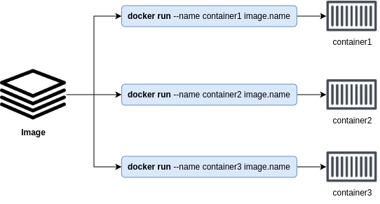

# Containers - The TLDR

Containers are run-time instances of images, and you can start one or more containers from a single image.

You can think of an image like a frozen VM. __Each time you generate an instance of this image a separate container is generated__.

Based on the graphic we can say that the containers: container1, container2 and container3. They are independent instances of the image on which they have been generated. When we say independent is because each container contains its files, its configuration and these changes will persist in the future until we do not delete the container itself.

> Although it should be noted that accessing and configuring containers is an anti-pattern, since the containers must be state-less.

## Containers vs VMs
