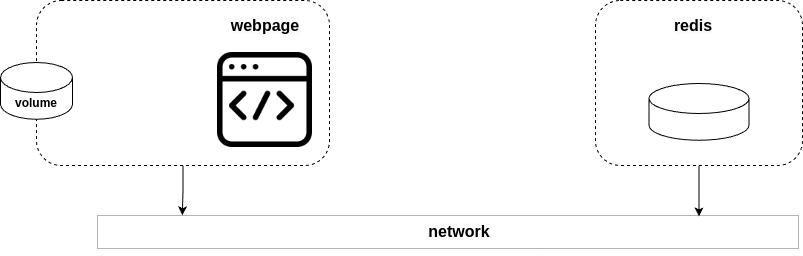

# Introduction

We create modern cloud-native applications by combining lots of small services that work together to form a useful app. We call them microservices applications, and they bring a lot of benefits, such as self-healing, autoscaling, and rolling updates. However, they can be complex.

For example, you might have a microservices app with the following services:
- Web front-end
- Ordering
- Catalog
- Back-end datastore
- Logging
- Authentication
- Authorization

Here is where compose kicks in. Instead of hacking together complex scripts and long docker commands, Compose lets you describe te application in a simple `YAML` file called Compose file.

## Compose background

When Docker was new, a company called _Orchard Labs_ built a tool called `Fig` that made deployming and managing multi-container apps easy. It wa a Python tool that ran on top of Docker and let you define complex multi-container microservices apps in a simple YAML file.

Behind the scene, Fix would read the YAML file and call the appropiate Docker commands to deploy and manage the app.

Fig was so good that Docker, Inc. acquired Orchard Land and rebranded `Fig` as `Docker Compose`. They renamed the command-line tool from fig to docker-compose, and then more recently, they folded it into the docker CLI with its own compose sub-command. You can now run simple `docker compose` commandsto easily manage mulit-container microservices apps.

There is also a [compose Specification](https://compose-spec.io/) driving Compose as an open starndard for defining multi-container microservices apps. The specification is community-led and kept separate from the Docker implementation to maintain better governance and clearer demarcation. However, Docker Compose is the reference implementation and you should expect Docker to implement the full spec.

> __NOTE__: Because of this compose it already comes with docker and can be called with `docker compose`.

## Before continuing

In the following section we will focus on more aspects of compose but using some code we have already build on.

If you haven't create the following code before continuing:
1. [Generate an instance of redis](../exercises/1-generate-a-redis-instance/README.md)
2. [Create a webpage](../exercises/2-generate-a-webpage/README.md)

## The sample app

The app we aim to build is a webpage that has a table with a couple of links on it and next to each link it has a counter. This webpage will save this values into a redis services and will ask for them in every run.

The objective of this project can be achieved by defining the following microservices:
- webpage: Container with the input endpoint where the webpage is displayed.
    - volumne: This container will map its code with that of the machine itself in such a way that the changes made to it will be visible in the container without the need to make changes.
- redis: Database where the accesses to each web page are registered.
- network: Network with which both containers can communicate.

This project would look like this:

- 

Now, through [exercise 1](../exercises/1-generate-a-redis-instance/README.md) and [exercise 2](../exercises/2-generate-a-webpage/README.md) you must adapt the webpage to communicate with Redis and register the accesses.

This exercise should be done [here](../exercises/3-webpage-communicates-with-redis/README.md).

## Creating the own compose file
