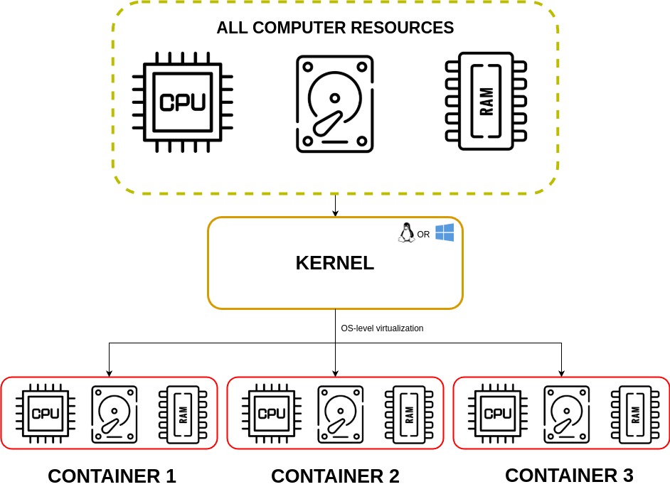

[__HOME__](../../README.md)

> [<- PREVIOUS CHAPTER](./1-introduction.md) __|__ [NEXT CHAPTER ->](./3-theory.md)
---

## INDEX:

- [How docker came to be?](#how-docker-came-to-be)
    - [How to achieve process isolation in a container?](#how-to-achieve-process-isolation-in-a-container)
- [Initiatives to promote and standardize containers](#initiatives-to-promote-and-standardize-containers)
    - [The Open Container Initiative](#the-open-container-initiative)
    - [The CNCF](#the-cncf)
    - [The Moby Project](#the-moby-project)

---

### How docker came to be?

Docker uses a system of OS-level virtualization that allows the kernel to isolate into multiple spaces.

This paradigm includes the following types of isolation:

- `Containers` (LXC, Solaris Containers, AIX WPARs, HP-UX SRP Containers, Docker, Podman)
- `Zones` (Solaris Containers)
- `Virtual` private servers (OpenVZ)
- `Partitions`
- `Virtual environments` (VEs)
- `Virtual kernels` (DragonFly BSD)
- `Jails` (FreeBSD jail and chroot)

Such instances may look like real computers from the point of view of programs running in them.

A computer program running on an ordinary operating system can see all resources connected devices, files and folders, network shares, CPU power, quantifiable hardware capabilities of that computer. Programs running inside a container can only see the container's contents and devices assigned to the container.

#### How to achieve process isolation in a container?

On Unix-like operating systems, this feature can be seen as an advanced implementation of the standard chroot mechanism, which changes the apparent root folder for the current running process and its children. In addition to isolation mechanisms, the kernel often provides resource-management features to limit the impact of one container's activities on other containers.

Linux containers are all based on the virtualization, isolation, and resource management mechanisms provided by the Linux kernel, notably:

- `namespaces`: Feature of the Linux kernel that partition kernel resources such that one set of processes sees one set of resources, while another set of processes sees a different set of resources.
- `cgroups`: Is a Linux kernel feature that limits, accounts for, and isolates the resource usage (CPU, memory, disk I/O, etc.[1]) of a collection of processes

Although the word container most commonly refers to OS-level virtualization, it is sometimes used to refer to fuller virtual machines operating in varying degrees of concert with the host OS, such as Microsoft's Hyper-V containers.

> NOTES: For an overview of virtualization since 1960, see [Timeline of virtualization technologies](https://en.m.wikipedia.org/wiki/Timeline_of_virtualization_technologies).

On ordinary operating systems for personal computers, a computer program can see (even though it might not be able to access) all the system's resources.

They include:
- Hardware capabilities that can be employed, such as the CPU and the network connection.
- Data that can be read or written, such as files, folders and network shares.
- Connected peripherals it can interact with, such as webcam, printer, scanner, or fax.

The operating system may be able to allow or deny access to such resources based on which program requests them and the user account in the context in which it runs. The operating system may also hide those resources, so that when the computer program enumerates them, they do not appear in the enumeration results. Nevertheless, from a programming point of view, the computer program has interacted with those resources and the operating system has managed an act of interaction.

__With operating-system-virtualization, or containerization, it is possible to run programs within containers, to which only parts of these resources are allocated__. A program expecting to see the whole computer, once run inside a container, can only see the allocated resources and believes them to be all that is available. Several containers can be created on each operating system, to each of which a subset of the computer's resources is allocated. Each container may contain any number of computer programs. These programs may run concurrently or separately, and may even interact with one another.

Containerization has similarities to application virtualization: In the latter, only one computer program is placed in an isolated container and the isolation applies to file system only.

---

### Initiatives to promote and standardize containers

#### [__The Open Container Initiative__](https://opencontainers.org/)

The Open Container Initiative is an open governance structure for the express purpose of creating open industry standards around container formats and runtimes.

Some history about OCI:
- It operates from the Linux Foundation and was founded in the early days of the container ecosystem when some of the people at a company called CoreOS didn't like the way docker was dominating the ecosystem.
- In response, CoreOS created an open standard called [`appc`](https://github.com/appc/spec) that defined specifications for things such as image format and container runtime.
- The `appc` standard did things differently from Docker and put the ecosystem in an awkward position with two competing standards.
- Competition is usually a good thing, competing standards are generally bad, as they generate confusion that slows down user adoption.
- The main figures of `appc` then decided to came together and formed the OCI as a vendor-neutral lightweight council to govern containers standards.

At the time of the writing the OCI maintains three standards called specs:
- [The image-spec](https://github.com/opencontainers/image-spec): Creates and maintains the software shipping container image format spec
- [The runtime-spec](https://github.com/opencontainers/runtime-spec): Develops specifications for standards on Operating System process and application containers
- [The distribution-spec](https://github.com/opencontainers/distribution-spec): Defines an API protocol to facilitate and standardize the distribution of content

#### [__The CNCF__](https://www.cncf.io/)

It was founded in 2015 with the goal of _"...advancing container technologies... and making cloud native computing ubiquitous"_. Instead of creating and maintaining container-related specifications, the CNCF host important project such as `Kubernetes`, `containerd`, `Notary`, `Prometheus`, `Cilium`, and lots more.

When we say the CNCF host these projects we mean it provides a space, structure, and support for projects to grow and mature. Fore example, all CNCF projects pass through the following three phases or stages:
- Sandbox: Gives support to new ideas and projects to
- Incubating: Gives the needed time to be production ready products
- Graduated: They are ready for production adn are guaranteed to have strong governance.

#### [__The Moby Project__](https://mobyproject.org/)

Place for developers to build specialized tools for building container platforms.

Platform builders can pick the specific Moby tools they need to build their container platform. They can even compose their platforms from a mix of Moby tools, in-house tools, and tools from other projects.

---

> [<- PREVIOUS CHAPTER](./1-introduction.md) __|__ [NEXT CHAPTER ->](./3-theory.md)