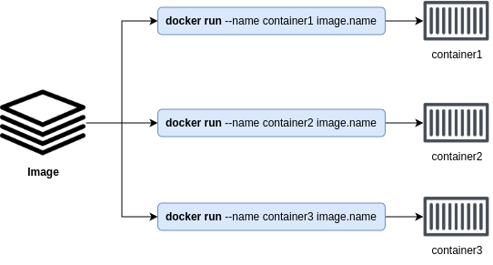

[__HOME__](../../README.md)

> [<- PREVIOUS CHAPTER](./3-theory.md) __|__ [NEXT CHAPTER ->](./5-images.md)
---

## INDEX:
- [Containers - The TLDR](#containers---the-tldr)
- [How container start apps](#how-container-start-apps)
- [Connecting into a docker image](#connecting-into-a-docker-image)
- [The main process from a docker](#the-main-process-from-a-docker)
- [Restart policies](#restart-policies)

---

# Containers - The TLDR

The [chapter on images](./5-images.md) goes into more detail about what Docker images actually are, but for now we can stick with the following.

Containers are run-time instances of images, and you can start one or more containers from a single image.

You can think of an image like a frozen VM. __Each time you generate an instance of this image a separate container is generated__.



Based on the graphic we can say that the containers: container1, container2 and container3. They are independent instances of the image on which they have been generated. When we say independent is because each container contains its files, its configuration and these changes will persist in the future until we do not delete the container itself.

> Although it should be noted that accessing and configuring containers is an anti-pattern, since the containers must be state-less.

## How container start apps

There are three ways you can tell Docker how to start an app in a container.

- Ways defined in the Dockerfile itself:
    - `ENTRYPOINT`: final execution that the container will perform after its initial installation is complete.
    - `CMD`: additional arguments that can be included when running a Docker image.
- `CLI`: The arguments sent through the CLI.

> If the `ENTRYPOINT` isn't set then docker it will run its default execution that its `/bin/bash -c` that will start a bash and then execute the `CMD`

In the [following exercise](../exercises/0-the-first-image/README.md) the first image in docker it will be build and also we will learn more about the entry points.

All the configurations (like entrypoints) from an image can be seen using the command `inspect`. For example, lets inspect the image we have build in the last exercise and lets find the `ENTRYPOINT` and its `CMD`.

```bash
docker inspect cowsay                                                                                            ──(Sun,Mar16)─┘
<snip>
            "Cmd": [
                "phenomenal"
            ],
            "ArgsEscaped": true,
            "Image": "",
            "Volumes": null,
            "WorkingDir": "",
            "Entrypoint": [
                "cowsay",
                "I hope your day is going well because mine is going"
            ],
<snip>
```

## Connecting into a docker image

You can use the `docker exec` command to execute commands in running containers, and it has two modes:
- __Interactive__: Connect your terminal to a shell process in the container and behave like remote a SSH session.
- __Remote execution__: Lets you send commands to a running container and prints the output to your local terminal.

You can try it connecting into the image `cowsay` done in the last exercise but changing the entrypoint to make `bin/bash` run

- `docker run -it --entrypoint /bin/bash cowsay`

```bash
$docker run -it --entrypoint /bin/bash cowsay
root@79168839daff:/# cowsay yo again
 __________
< yo again >
 ----------
        \   ^__^
         \  (oo)\_______
            (__)\       )\/\
                ||----w |
                ||     ||
root@79168839daff:/# 
```

The started session can be terminated using the prompt exit.

## The main process from a docker

Most containers only run a single process. This is the container's main app process and is always PID 1. This can be seen running the command `ps` in your container.

You can run alpine to test what has been told:
```bash
docker run -it alpine sh
```

> __NOTE__: Notice that the command sent to the docker container to start a session isn't /bin/bash. Instead of that it's sh. Thats because that image doesn't have the same shell.

Once you have started your session you can run the command ps and this is what you'll see:
```bash
/ # ps
PID   USER     TIME  COMMAND
    1 root      0:00 sh
    7 root      0:00 ps
```

> __NOTE__: Not all base images has the command ps or the ability to create sessions. Take this in mind.

Each of PID belongs to the following process:
| __PID__ | __BELONGS TO__ |
|-----|------------|
| 1   | The running terminal |
| 7   | The last ps command executed |

> If you kill the docker main process the container will be stopped

Looking at the running processes we can say that once the terminal terminates the container will die.

This can be checked by executing the following commands:
```bash
# Here we have opened another terminal to keep the container alive and listing the running containers.
docker ps
CONTAINER ID   IMAGE     COMMAND   CREATED         STATUS         PORTS     NAMES
c69d4e2584d6   alpine    "sh"      5 minutes ago   Up 5 minutes             exciting_yonath
# Here we are linking our current session on the container and ending it.
docker attach exciting_yonath
/ # exit
# Here we are listing the running processes again
docker ps
CONTAINER ID   IMAGE     COMMAND   CREATED   STATUS    PORTS     NAMES
```

In the last section we can see that there is no longer any container running, however, if we do a `docker ps -a` we can see our previous container called `exciting_yonath`.
```bash
docker ps -a
CONTAINER ID   IMAGE     COMMAND                  CREATED          STATUS                        PORTS     NAMES
c69d4e2584d6   alpine    "sh"                     11 minutes ago   Exited (0) 4 minutes ago                exciting_yonath
```

## Restart policies

Container restart policies are a simple form of self-healing that allows the local Docker Engine to automatically restart failed containers.

The existing conditions that can trigger a restart policy are the following:
- `no` (default): Containers never restarts automatically
- `on-failure`: Will restart if the container exits with a non-zero status
- `always`: It will always restart
- `unless-stopped`: It will always restart unless manually is stopped by the user

> __NOTE__: If the Daemon is been restarted all containers will be restarted (unless the `no` or `unless-stopped` condition)

This conditions can be set when running a container. For example, and using the `alphine` base image we have saw before.

As far as we know, the `alpine` image does not have any processes running. This causes it to terminate if we run it on its own (in the previous case it did not terminate because our own sh session kept it alive).

We can check this by running the following:
```bash
docker ps
CONTAINER ID   IMAGE     COMMAND   CREATED   STATUS    PORTS     NAMES
docker run alpine
docker ps
CONTAINER ID   IMAGE     COMMAND   CREATED   STATUS    PORTS     NAMES
```

However, if we add the restart policy `always` the container will keep raising up even when starting it will cause to get stopped.

This can be seen in the following:
```bash
# Starting a docker with a restart policy
docker run --restart always alpine
# The docker has started
docker ps
CONTAINER ID   IMAGE     COMMAND     CREATED         STATUS                                  PORTS     NAMES
07ebeca5db30   alpine    "/bin/sh"   4 seconds ago   Restarting (0) Less than a second ago             cool_satoshi
# And here its restarting
docker ps
CONTAINER ID   IMAGE     COMMAND     CREATED         STATUS                  PORTS     NAMES
07ebeca5db30   alpine    "/bin/sh"   4 seconds ago   Up Less than a second             cool_satoshi
docker ps
CONTAINER ID   IMAGE     COMMAND     CREATED         STATUS                                  PORTS     NAMES
07ebeca5db30   alpine    "/bin/sh"   5 seconds ago   Restarting (0) Less than a second ago             cool_satoshi
docker ps
CONTAINER ID   IMAGE     COMMAND     CREATED         STATUS                        PORTS     NAMES
07ebeca5db30   alpine    "/bin/sh"   6 seconds ago   Restarting (0) 1 second ago             cool_satoshi
docker ps
CONTAINER ID   IMAGE     COMMAND     CREATED         STATUS                         PORTS     NAMES
07ebeca5db30   alpine    "/bin/sh"   7 seconds ago   Restarting (0) 2 seconds ago             cool_satoshi
# And here is restarting again
docker ps
CONTAINER ID   IMAGE     COMMAND     CREATED         STATUS                                  PORTS     NAMES
07ebeca5db30   alpine    "/bin/sh"   9 seconds ago   Restarting (0) Less than a second ago             cool_satoshi
docker ps
CONTAINER ID   IMAGE     COMMAND     CREATED          STATUS                         PORTS     NAMES
07ebeca5db30   alpine    "/bin/sh"   10 seconds ago   Restarting (0) 2 seconds ago             cool_satoshi
```


---
> [<- PREVIOUS CHAPTER](./3-theory.md) __|__ [NEXT CHAPTER ->](./5-images.md)