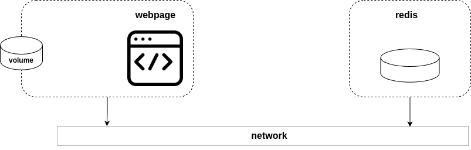

[__HOME__](../../README.md)

> [⬅️ PREVIOUS CHAPTER](./4-images.md) __|__ [NEXT CHAPTER ➡️](./6-swarm.md)
---

## INDEX:
- [Introduction](#introduction)
  - [Compose background](#compose-background)
  - [Before continuing](#before-continuing)
  - [The sample app](#the-sample-app)
  - [The structure of the compose yaml](#the-structure-of-the-compose-yaml)
- [Compose commands](#compose-commands)
  - [Creating your own compose file](#creating-your-own-compose-file)

---

### Introduction

We create modern cloud-native applications by combining lots of small services that work together to form a useful app. We call them microservices applications, and they bring a lot of benefits, such as self-healing, autoscaling, and rolling updates. However, they can be complex.

For example, you might have a microservices app with the following services:
- Web front-end
- Ordering
- Catalog
- Back-end datastore
- Logging
- Authentication
- Authorization

Here is where compose kicks in. Instead of hacking together complex scripts and long Docker commands, Compose lets you describe the application in a simple `YAML` file called Compose file.

#### Compose background

When Docker was new, a company called _Orchard Labs_ built a tool called `Fig` that made deploying and managing multi-container apps easy. It was a Python tool that ran on top of Docker and let you define complex multi-container microservices apps in a simple YAML file.

Behind the scenes, Fig would read the YAML file and call the appropriate Docker commands to deploy and manage the app.

Fig was so good that Docker, Inc. acquired Orchard Labs and rebranded `Fig` as `Docker Compose`. They renamed the command-line tool from fig to docker-compose, and then more recently, they folded it into the Docker CLI with its own compose sub-command. You can now run simple `docker compose` commands to easily manage multi-container microservices apps.

There is also a [compose specification](https://compose-spec.io/) driving Compose as an open standard for defining multi-container microservices apps. The specification is community-led and kept separate from the Docker implementation to maintain better governance and clearer demarcation. However, Docker Compose is the reference implementation and you should expect Docker to implement the full spec.

> __NOTE__: Because of this compose it already comes with Docker and can be called with `docker compose`.

#### Before continuing

In the following section we will focus on more aspects of compose but using some code we have already built on.

If you haven't created the following code before continuing:
1. [Generate an instance of Redis](../exercises/1-generate-a-redis-instance/README.md)
2. [Create a webpage](../exercises/2-generate-a-webpage/README.md)

#### The sample app

The app we aim to build is a webpage that has a table with a couple of links on it and next to each link it has a counter. This webpage will save these values into a Redis services and will ask for them in every run.

The objective of this project can be achieved by defining the following microservices:
- webpage: Container with the input endpoint where the webpage is displayed.
    - volume: This container will map its code with that of the machine itself in such a way that the changes made to it will be visible in the container without the need to make changes.
- Redis: Database where the accesses to each web page are registered.
- network: Network with which both containers can communicate.

This project would look like this:

- 

Now, through [exercise 1](../exercises/1-generate-a-redis-instance/README.md) and [exercise 2](../exercises/2-generate-a-webpage/README.md) you must adapt the webpage to communicate with Redis and register the accesses.

This exercise should be done [here](../exercises/3-webpage-communicates-with-redis/README.md).

#### The structure of the compose yaml

In the following yaml it will be shown the basic structure of this kind of files:
```yaml
services:                               # Defines the number of services (containers) that there will be raised
  web:
    build: .                 # This container will be created with a concrete Dockerfile
    ports:
      - "8080:80"                       # Maps the port with which the user can access the container and the port where the request will be received
    volumes:
      - ./html:/usr/share/nginx/html    # Volumes defined
    networks:
      - app_network                     # Networks on which this container will be exposed
    depends_on:
      - db                              # Tells that this container can be raised before the other
    restart: always                     # Restart policies
    environment:
      - NGINX_HOST=example.com          # Environment variables
      
  db:
    image: postgres:13                  # This container will be created with a concrete image
    container_name: database
    networks:
      - app_network
    environment:
      - POSTGRES_USER=user
      - POSTGRES_PASSWORD=password
      - POSTGRES_DB=myapp
    restart: unless-stopped
    
networks:
  app_network:
    driver: bridge
```

In the end, Compose will raise containers as if we were doing it with the Docker CLI itself. this means that if we do a Docker ps we can see the raised containers themselves.

A point to indicate is that these will have as named according to the Compose configuration.

### Compose commands:

The commands to be highlighted on the compose CLI itself are the following:
- `docker compose up`: It creates all images, containers, networks, and volumes the app needs. It expects you to call the Compose file compose.yaml, but you can specify a custom filename with the -f flag.
- `docker compose stop`: Stops all containers in a compose app without deleting them. 
- `docker compose restart`: Restart a stopped compose app.
- `docker compose ps`: Restarts a stopped Compose app.
- `docker compose down`: Will stop and delete a running compose app.

#### Creating your own compose file

When you deploy the app, you'll use the Docker compose command to send the compose.yaml file to Docker. Docker will create the counter-net network and the counter-vol volume and use the Dockerfile to build an OCI image for the webpage service. The Dockerfile tells Docker to copy the code from the app folder into the image.

Docker then starts the webpage, mounts the volume, and connects to the network. It also starts a container for the Redis service and connects that to the same network.

In [this exercise](../exercises/4-compose/README.md) you will create a compose.yaml that defines the solution.

---
> [⬅️ PREVIOUS CHAPTER](./4-images.md) __|__ [NEXT CHAPTER ➡️](./6-swarm.md)