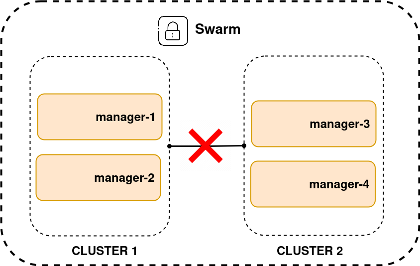

[__HOME__](../../README.md)

> [⬅️ PREVIOUS CHAPTER](./5-compose.md) __|__ [NEXT CHAPTER ➡️](./7-stack.md)
---


## INDEX

- [Introduction](#introduction)
- [Building a swarm](#building-a-swarm)  
  - [Pre requisites (Multipass)](#pre-requisites-multipass)  
  - [Building your Docker nodes](#building-your-docker-nodes)  
  - [Troubleshooting](#troubleshooting)  
  - [Initializing a new swarm](#initializing-a-new-swarm)  
  - [Joining workers into the swarm](#joining-workers-into-the-swarm)  
- [Notes about the swarm](#notes-about-the-swarm)  
  - [Swarm manager high availability](#swarm-manager-high-availability)  
  - [Communication problems between clusters in a swarm](#communication-problems-between-clusters-in-a-swarm)  
  - [Locking a swarm](#locking-a-swarm)  
  - [Services](#services)  
    - [Replicated vs global services](#replicated-vs-global-services)  
    - [Scaling services](#scaling-services)  
    - [Deleting services](#deleting-services)  
  - [Dedicated manager nodes](#dedicated-manager-nodes)  
  - [The desired state](#the-desired-state)  
  - [Rollouts](#rollouts)  
  - [Service logs](#service-logs)  
- [Deploying and managing an app on swarm](#deploying-and-managing-an-app-on-swarm)  
  - [Example imperatively](#example-imperatively)  
  - [Checking if the service works](#checking-if-the-service-works)  
  - [Deleting the service](#deleting-the-service)  

---

### Introduction

On the clustering front, Swarm groups one or more Docker nodes into a cluster.

With it you can get:
- Encrypted distributed cluster store: On which you can save secrets
- Encrypted networks: On which you enable your containers and clusters to communicate securely with each other
- Mutual TLS: To enable authentication between swarm nodes
- Secure cluster join tokens: To securely add new nodes to the swarm
- PKI: An encrypted Raft-based cluster store used internally by Swarm, including for managing secrets

We call these clusters _swarms_.

There are two types of nodes created inside a cluster which are:
- `manager`: Run the control plane services that maintain the state of the cluster and schedule user applications to workers
- `worker`: Run the user application

The swarm stores its state and configuration in an in-memory distributed database that replicates across all manager nodes. Swarm uses TLS to encrypt communications, authenticate nodes, and authorize roles.

- 

> On the orchestration front, Swarm makes it easy to deploy and manage container applications.

### Building a swarm

In this section, you'll build locally the following swarm cluster with 1 manager and 1 worker.

#### Pre requisites (Multipass)

Given that locally we only have our own computer and that Swarm orchestrates different computers to work together, it is necessary to set up virtual machines to simulate each of the computers we will need.

To accomplish that you can use [Multipass](https://canonical.com/multipass/install).
```bash
# In case you don't have snap distributor execute the following command
# sudo apt install snapd
# If you had to install snapd, remember to include the snapd binaries in the PATH
# If you are working with ZSH, this can be done with the following command 
# `export PATH="$PATH:/snap/bin"`

sudo snap install multipass
```

#### Building your Docker nodes

Once you have installed multipass we will need to create all the virtual machines that will sustain each node.

Each node will have the following specs:
- 2 CPU
- 40GB disk
- 4GB RAM

```bash
multipass launch docker --name manager1 --cpus 2 --disk 40G --memory 4G
multipass launch docker --name worker1 --cpus 2 --disk 40G --memory 4G
```

###### Troubleshooting

1. `error launch failed: multipass socket access denied`:
    - This error means that the socket used to allow your kernel to speak with multipass is protected. To give access to it you have to execute the following command `sudo chmod 666 /var/snap/multipass/common/multipass_socket`.
2. `launch failed: KVM support is not enabled on this machine.`   
    - The problem is that your BIOS doesn't have enabled virtualization.
    - This means that you will have to enter the BIOS to enable it

You can check if the virtual machines have been created with the following command:
```bash
multipass ls
Name                    State             IPv4             Image
manager1                Running           10.222.216.226   Ubuntu 24.04 LTS
                                          172.17.0.1
worker1                 Running           10.222.216.30    Ubuntu 24.04 LTS
                                          172.17.0.1
```

Lastly, you can check that if multipass has correctly created the VM connecting to it and checking if it has Docker installed.

This can be done with the following commands:
```bash
multipass shell manager1
docker --version
Docker version 28.1.1, build 4eba377
exit
logout
```

#### Initializing a new swarm

The process of building a swarm is called `initializing` a swarm and it's a high-level process.

This is accomplished with the following actions:
1. Initialize the first manager
2. Join additional managers
3. Join workers

The Docker engine has the following modes:
- `single-engine mode`: On which it runs regular containers
- `swarm-mode`: On which can receive orders to execute containers as a swarm

When a Docker engine joins a swarm it enables the `swarm-mode`.

Following the high level description defined above we will start creating the first manager of the swarm. This action will be done inside the VM that will be the manager (this means that we will have to use the command `multipass shell manager1`) and execute the command `docker swarm init` adding the IP on which the VM that will serve as a manager is reachable.

> __NOTE__: We can identify the IP of the virtual machine using the command multipass ls and the port it will be `2377` which is the default port from Docker to enable swarm communications

To accomplish this we will have to execute the following commands:
```bash
multipass shell manager1
docker swarm init \
    --advertise-addr 10.222.216.226:2377 \
    --listen-addr 10.222.216.226:2377
Swarm initialized: current node (d1nlhrih8a3kmjlef3s22rjrw) is now a manager.

To add a worker to this swarm, run the following command:

    docker swarm join --token SWMTKN-1-4wlq6le2gs765sio8u8v5lm19b4eekwq72nbk2925111ycat46-6garqnzdhojyzqk30p2l8fkhs 10.222.216.226:2377

To add a manager to this swarm, run 'docker swarm join-token manager' and follow the instructions.
```

You can check if the swarm has ben correctly created using this command:
```bash
docker node ls
ID                            HOSTNAME   STATUS    AVAILABILITY   MANAGER STATUS   ENGINE VERSION
d1nlhrih8a3kmjlef3s22rjrw *   manager1   Ready     Active         Leader           28.1.1
```

#### Joining workers into the swarm

To join workers into the swarm (or other managers) it will be needed to provide a token to the manager that verifies the node to enter the swarm.

This tokens can be shown using the following command:
```bash
# TOKEN TO GIVE TRANSFORM A VM INTO A WORKER NODE
docker swarm join-token worker
To add a worker to this swarm, run the following command:

    docker swarm join --token SWMTKN-1-4wlq6le2gs765sio8u8v5lm19b4eekwq72nbk2925111ycat46-6garqnzdhojyzqk30p2l8fkhs 10.222.216.226:2377

# TOKEN TO GIVE TRANSFORM A VM INTO A MANAGER NODE
docker swarm join-token manager
To add a manager to this swarm, run the following command:

    docker swarm join --token SWMTKN-1-4wlq6le2gs765sio8u8v5lm19b4eekwq72nbk2925111ycat46-6dacj1wyh8ovblkui4nlp2vdp 10.222.216.226:2377
```

> __NOTE__: This actions are done from the VM `manager1` 

Now its time to add the worker into the swarm. To accomplish this we will have to make the following:
```bash
multipass shell worker1
docker swarm join \
    --token SWMTKN-1-4wlq6le2gs765sio8u8v5lm19b4eekwq72nbk2925111ycat46-6garqnzdhojyzqk30p2l8fkhs 10.222.216.226:2377 \
    --advertise-addr 10.222.216.30:2337 \
    --listen-addr 10.222.216.30:2337
```

If the command has ended successfully you can check inside throw the manager (because the worker won't be able to see these details) using again the `docker node ls` command.

- 

In this image you can see that the `manager1` (upper terminal) is listing two nodes and the `worker1` (downer terminal) can't list any node.


### Notes about the swarm

#### Swarm manager high availability

Swarm clusters are highly available (HA), meaning one or more managers can fail, and the swarm will keep running.

This is accomplished with the manager roles `leader` and `follower`. These roles defines who of the managers can changes the state of the cluster. Meaning that he is allowed to scale, deploy, manage nodes and handle orchestration or scheduling.

> __NOTE__: Leader and follower is Raft terminology, and we use it because Swarm implements the [Raft consensus algorithm](https://raft.github.io/) to maintain a consistent cluster state across multiple highly-available managers.

However it has to be taken into account that there are needed to apply some practices to apply HA correctly which are:
1. Always deploy an odd number of managers
2. Don't deploy too many managers (3 or 5 is usually enough)
3. Spread managers across availability zones

#### Communication problems between clusters in a swarm

Consider the following scenario: we have a Swarm consisting of several managers distributed in two locations (or groups), and communication between them is lost.

- 

In this case, the worker nodes will continue to execute the tasks already assigned to them, so they will still be able to respond to user requests, as long as traffic continues to reach them.

However, managers that lose the majority (quorum) will not be able to make changes to the cluster state, such as scaling services or deploying new containers.

The group that retains the majority of managers (Raft quorum) will be the one that can:
1. Elect a valid leader
2. Continue to modify the cluster state (create/scale/update services).

The isolated group without quorum will enter read-only mode and will not be able to modify the cluster state.

If we take into account the above explanation we can correct why one of the practices to achieve HA is to have an odd number of managers.

- 

In the case of cluster isolation, neither side will be able to have a majority to define a valid leader and modify the status of its cluster.

#### Locking a swarm

Despite all of Swarm's security features, restarting an old manager or restoring an old backup can potentially compromise your cluster. For example, a malicious actor with access to an old manager node may be able to re-join it to the swarm and gain unwanted access.

Fortunately, you can use Swarm's autolock feature to force restarted managers __to present themselves a key before being admitted back into the swarm__.

You can autolock new swarms at build time by passing the `--autolock` flag to the Docker `swarm init command`. For existing swarms, you can autolock them with the `docker swarm update` command

Here is an example of the output locking our own cluster:
```bash
docker swarm update --autolock
Swarm updated.
To unlock a swarm manager after it restarts, run the `docker swarm unlock`
command and provide the following key:

    SWMKEY-1-Llcid7CmlGQYMK+z0CoRiHBbEyWcUXyROjRNb4ObxNQ

Remember to store this key in a password manager, since without it you
will not be able to restart the manager.
```

Keep safe that token. Because if a manager is been restarted and needs to rejoin to the swarm it will have to provide that TOKEN.

Once this command is been executed all your manager nodes that are restarted won't be able to access the swarm unless the swarm is unlock from each node.

Here is an example where the swarm is unlocked by a worker:
```bash
docker swarm unlock SWMKEY-1-Llcid7CmlGQYMK+z0CoRiHBbEyWcUXyROjRNb4ObxNQ
```

#### Services

The functionalities exposed by a SWARM are known as services.

The following aspects are defined in a service:
- Which image will be used to create containers
- How many replicas (containers) will have to be created to meet the demand for the service.
- On which ports the service will be exposed
- What to do when a replica no longer provides the expected response.
- What to do when demand is higher than expected.
- And many more points

If you notice, the characteristics of a service are the same as those provided by cloud services, i.e. whatever you do, it will always have a response from the software used.

You can get more detail of a service raised through the following command:
```bash
# List all existing services
docker service ls
# Retrieve more details about a concrete service
docker service inspect --pretty $(service-name) 
# NOTE: Pretty its just a flag to show the results in a more readable format instead of JSON
```

##### Replicated vs global services

Swarm has two modes for deploying replicas to nodes:
- __Replicated (default)__: Deploys as many replicas as you need and attempts to distribute them evenly across available nodes.
- __Global__: Deploys a single replica on every available node in the swarm

> __NOTE__: Both modes respect node availability and will only deploy replicas to eligible nodes. For example, if you don't allow your swarm to deploy applications to managers, both modes will only deploy to workers

To enable one or other, you must specify the `--mode` flag when creating a service.

##### Scaling services

Another powerful feature of services is the ability to scale them up and down by adding or removing replicas.

Assume business is booming and you're experiencing double the number of requests to your web front-end. 

You can scale the number of replicas with the following prompt:
```bash
docker service scale $(service-name)=$(number-of-replicas)
```

##### Deleting services

Running the following command will remove the service from the swarm. This means that the apps in the service's containers will no longer be available.

This can be done with the following command:
```bash
docker service rm $(service-name)
```

#### Dedicated manager nodes

By default, Swarm __runs user applications on workers and managers__. However, you may want to configure your production swarm clusters to only run user applications on workers. This allows managers to focus exclusively on control-plane duties.

Run the following command on any manager to prevent it from running user applications. __You'll need to use the names of your managers, and you'll need to run it on all managers if you want to force user applications to run only on workers__.

```bash
docker node update --availability drain manager1
```

#### The desired state

Even if the action is performed imperatively the state is saved in the cluster store. __Swarm will run reconciliation loop that constantly compares the observed state of the cluster with the desired state__. When the two states match, the world is a happy place, and no further action is needed. When they don't match, Swarm takes action to bring the observed state into line with desired state. 

For example, if a worker hosting one of the five replicas fails, the observed state of the cluster will drop from 5 replicas to 4 and no longer match the desired state of 5. As soon as the swarm observes the difference, it will start a new replica to bring the observed state back in line with desired state.

#### Rollouts

Application updates are a fact of life, and for the longest time they were painful. I've personally lost more than enough weekends to major application updates and I've no intention of doing it again.

Fortunately, thanks to Docker services, updating well-designed microservices apps is easy.

> __NOTE__: We use terms like rollouts, updates, and rolling updates to mean the same thing. That is updating a live application.

Swarm manages it all by itself when updating a service.

For example, lets say we want to change the image used by a service.
```bash
# Service created
docker service create --name dummy \
    -p 5000:5000 \
    --replicas 5 \
    joeyratt/webpage:latest
```
```bash
# Updating the service
docker service update \
    --image joeyratt/webpage:v2.0
    --update-parallelism 2 \
    --update-delay 20s \
    dummy
```

When executing this update swarm will remove each of the old replicas keeping one alive until the rollout is finish. From the update prompt there are the following things that have to be taken into account:
- `--update-parallelism`: Only 2 tasks will be updated at the same time
- `--update-delay`: After a batch is been done it waits 20 seconds and then starts again

Swarm will wait for the new tasks to become healthy before shutting down the old ones.

#### Service logs

You can inspect a service's logs with the `docker service logs $(service-name)` command. It gathers the logs from every replica and displays them in a single output.

By default, Docker configures services to use the json-file log friver, but other drivers exist, including:
- awslogs
- gelf
- gcplogs
- journald
- splunk
- syslogs

### Deploying and managing an app on swarm

Swarm nodes can run regular containers, but they can also run enhanced containers called services. Each service takes a single container definition and augments it with cloud-native features such as self-healing, scaling, and automated rollouts and rollbacks.

In this section, you'll deploy a simple web server as a swarm service and see how to scale it, perform rollouts, and delete it.

Swarm lets you create and manage services in two ways:
- __Imperatively__: This means that it uses the command line
- __Declaratively__: This means with a Compose file

The correct way is declaratively because it defines a file on which actions can be declared and replicated but since this is an introductory chapter (and the imperative system allows phasing of actions) we will only address the imperative system.

#### Example imperatively

In this example it will be used the image already [loaded in the exercise 2](../exercises/2-generate-a-webpage/README.md) to create a service.

To accomplish that execute the following commands in the manager:
```bash
multipass shell manager1
docker service create --name web-fe \
    -p 5000:5000 \
    --replicas 5 \
    joeyratt/webpage:latest
```

This is the output:
```bash
ubuntu@manager1:~$ docker service create --name web-fe \
    -p 5000:5000 \
    --replicas 5 \
    joeyratt/webpage:latest
d9vjcml3dr0iavdfb9gff4xps
overall progress: 5 out of 5 tasks 
1/5: running   [==================================================>] 
2/5: running   [==================================================>] 
3/5: running   [==================================================>] 
4/5: running   [==================================================>] 
5/5: running   [==================================================>] 
verify: Service d9vjcml3dr0iavdfb9gff4xps converged 
```

If we have a similar results, it can be stated that:
- The service `web-fe` has been created
- Every swarm node exposes the port 5000 for each replica
- Five replicas ha been created (containers) to supply the demand of this service 

The last statement can be confirmed if we get inside the worker1 and list the running containers:
```bash
docker ps
CONTAINER ID   IMAGE                     COMMAND                  CREATED         STATUS         PORTS                                                             NAMES
74d3ef990ba7   joeyratt/webpage:latest   "python3 -m flask --…"   2 minutes ago   Up 2 minutes                                                                     web-fe.2.oeyvfh7ag10c5idm7qy4xvas0
6126195dec37   joeyratt/webpage:latest   "python3 -m flask --…"   2 minutes ago   Up 2 minutes                                                                     web-fe.3.t6imh8h7u00t2mqh5tynfi0l9
856d29261236   joeyratt/webpage:latest   "python3 -m flask --…"   2 minutes ago   Up 2 minutes                                                                     web-fe.4.z25f55wgxklqnp9sj8fi0c5zc
a0a8f430c43c   joeyratt/webpage:latest   "python3 -m flask --…"   2 minutes ago   Up 2 minutes                                                                     web-fe.5.zowe7mxpnxgav29rvpdk965o3
d5cea5672cb0   joeyratt/webpage:latest   "python3 -m flask --…"   2 minutes ago   Up 2 minutes                                                                     web-fe.1.vsngxuzydllj7wzwafxbjczq8
fabd9e47f458   portainer/portainer-ce    "/portainer"             2 hours ago     Up 2 hours     8000/tcp, 9443/tcp, 0.0.0.0:9000->9000/tcp, [::]:9000->9000/tcp   portainer
```

##### Checking if the service works

If we look back, exercise 2 created a web page. This means that the `web-fe` service is a web page. We will be able to access it from the browser if we launch the request to one of the IPs of the virtual machines in multipass.

- 

Like we have told in the [services](#services) section you can get the full details of the service with the prompt  `docker service inspect --pretty web-fe`.

Here is an example of the execution:
```bash
ubuntu@manager1:~$ docker service inspect --pretty web-fe

ID:		d9vjcml3dr0iavdfb9gff4xps
Name:		web-fe
Service Mode:	Replicated
 Replicas:	5
Placement:
UpdateConfig:
 Parallelism:	1
 On failure:	pause
 Monitoring Period: 5s
 Max failure ratio: 0
 Update order:      stop-first
RollbackConfig:
 Parallelism:	1
 On failure:	pause
 Monitoring Period: 5s
 Max failure ratio: 0
 Rollback order:    stop-first
ContainerSpec:
 Image:		joeyratt/webpage:latest@sha256:c2a542df76b9f3d41b1895f9ed6c8632f49aa9e5644cddb4ea2c285600d2adf7
 Init:		false
Resources:
Endpoint Mode:	vip
Ports:
 PublishedPort = 5000
  Protocol = tcp
  TargetPort = 5000
  PublishMode = ingress 
```

##### Deleting the service

At this point we can confirm that we have a swarm cluster with 1 manager and 1 worker which exposes a web page accessible via the cluster.

Since we will reuse the cluster it will only be necessary to delete the service created with the command `docker service rm web-fe`.

Below is an example of the execution of this command:
```bash
ubuntu@manager1:~$ docker service ls    # LISTING ALL SERVICES
ID             NAME      MODE         REPLICAS   IMAGE                     PORTS
d9vjcml3dr0i   web-fe    replicated   5/5        joeyratt/webpage:latest   *:5000->5000/tcp
ubuntu@manager1:~$ docker service ps web-fe     # LISTING ALL REPLICAS FOR A CONCRETE SERVICE
ID             NAME           IMAGE                     NODE      DESIRED STATE   CURRENT STATE            ERROR     PORTS
yplmz7e3wtkd   web-fe.1       joeyratt/webpage:latest   worker1   Running         Running 2 minutes ago              
t8tihwt284f6    \_ web-fe.1   joeyratt/webpage:latest   worker1   Shutdown        Shutdown 2 minutes ago             
komqbaf2ftoj    \_ web-fe.1   joeyratt/webpage:latest   worker1   Shutdown        Shutdown 2 minutes ago             
vsngxuzydllj    \_ web-fe.1   joeyratt/webpage:latest   worker1   Shutdown        Shutdown 2 minutes ago             
14ko5y4bljam   web-fe.2       joeyratt/webpage:latest   worker1   Running         Running 2 minutes ago              
q3uyvc57xkz9    \_ web-fe.2   joeyratt/webpage:latest   worker1   Shutdown        Shutdown 2 minutes ago             
1kdl2cgu90cz    \_ web-fe.2   joeyratt/webpage:latest   worker1   Shutdown        Shutdown 2 minutes ago             
oeyvfh7ag10c    \_ web-fe.2   joeyratt/webpage:latest   worker1   Shutdown        Shutdown 2 minutes ago             
ir2orhlcjbgl   web-fe.3       joeyratt/webpage:latest   worker1   Running         Running 2 minutes ago              
bvv7gr8cbjdg    \_ web-fe.3   joeyratt/webpage:latest   worker1   Shutdown        Shutdown 2 minutes ago             
2yfes7khyiro    \_ web-fe.3   joeyratt/webpage:latest   worker1   Shutdown        Shutdown 2 minutes ago             
t6imh8h7u00t    \_ web-fe.3   joeyratt/webpage:latest   worker1   Shutdown        Shutdown 2 minutes ago             
s2mj4k7oa9m2   web-fe.4       joeyratt/webpage:latest   worker1   Running         Running 2 minutes ago              
yov6wyfzqoca    \_ web-fe.4   joeyratt/webpage:latest   worker1   Shutdown        Shutdown 2 minutes ago             
8k6uy3tsx8n9    \_ web-fe.4   joeyratt/webpage:latest   worker1   Shutdown        Shutdown 2 minutes ago             
z25f55wgxklq    \_ web-fe.4   joeyratt/webpage:latest   worker1   Shutdown        Shutdown 2 minutes ago             
9rx807a15hyj   web-fe.5       joeyratt/webpage:latest   worker1   Running         Running 2 minutes ago              
llx53sylzkzd    \_ web-fe.5   joeyratt/webpage:latest   worker1   Shutdown        Shutdown 2 minutes ago             
me6shdqj6njf    \_ web-fe.5   joeyratt/webpage:latest   worker1   Shutdown        Shutdown 2 minutes ago             
zowe7mxpnxga    \_ web-fe.5   joeyratt/webpage:latest   worker1   Shutdown        Shutdown 2 minutes ago             
# NOTE: SWARM KEEPS TRACK OF THE REPLICAS THAT HAVE BEEN SHUTED DOWN
ubuntu@manager1:~$ docker service rm web-fe # REMOVING WEB-FE SERVICE
web-fe
# HERE IS BEEN CHECK THAT THE SERVICE WEB-FE DOESN'T EXIST ANYMORE
ubuntu@manager1:~$ docker service ls
ID        NAME      MODE      REPLICAS   IMAGE     PORTS
ubuntu@manager1:~$ docker service ps web-fe
no such service: web-fe
```

If you want you can double check that the replicas of that service have been removed by checking the raised containers in the own worker node:
```bash
# BEFORE DELETING WEB-FE SERVICE
ubuntu@worker1:~$ docker ps
CONTAINER ID   IMAGE                     COMMAND                  CREATED         STATUS         PORTS                                                             NAMES
4b1fab2cb5be   joeyratt/webpage:latest   "python3 -m flask --…"   7 seconds ago   Up 2 seconds                                                                     web-fe.3.ir2orhlcjbgltdoz39923s5ne
e828f419b199   joeyratt/webpage:latest   "python3 -m flask --…"   7 seconds ago   Up 2 seconds                                                                     web-fe.5.9rx807a15hyjbsish1870fnkw
ef854182f65b   joeyratt/webpage:latest   "python3 -m flask --…"   7 seconds ago   Up 2 seconds                                                                     web-fe.2.14ko5y4bljam7aloncc1u2i2q
99e46f2be918   joeyratt/webpage:latest   "python3 -m flask --…"   7 seconds ago   Up 2 seconds                                                                     web-fe.4.s2mj4k7oa9m2f8oma5jwi3y5v
8259a05beaa3   joeyratt/webpage:latest   "python3 -m flask --…"   7 seconds ago   Up 2 seconds                                                                     web-fe.1.yplmz7e3wtkdgawzwkanhsqcu
fabd9e47f458   portainer/portainer-ce    "/portainer"             15 hours ago    Up 7 seconds   8000/tcp, 9443/tcp, 0.0.0.0:9000->9000/tcp, [::]:9000->9000/tcp   portainer
# AFTER DELETING WEB-FE SERVICE
ubuntu@worker1:~$ docker ps
CONTAINER ID   IMAGE                    COMMAND        CREATED        STATUS         PORTS                                                             NAMES
fabd9e47f458   portainer/portainer-ce   "/portainer"   15 hours ago   Up 3 minutes   8000/tcp, 9443/tcp, 0.0.0.0:9000->9000/tcp, [::]:9000->9000/tcp   portainer
```

---
> [⬅️ PREVIOUS CHAPTER](./5-compose.md) __|__ [NEXT CHAPTER ➡️](./7-stack.md)