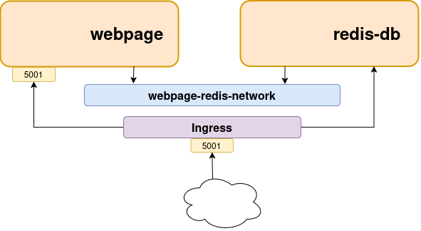

[__HOME__](../../README.md)

> [⬅️ PREVIOUS CHAPTER](./6-swarm.md) __|__ [NEXT CHAPTER ➡️](./8-network.md)
---


## INDEX
- [Introduction](#introduction)  
- [Prepare environment](#prepare-environment)  
  - [Hands on](#hands-on)  
    - [Looking closer at the stack file](#looking-closer-at-the-stack-file)  
      - [Network](#network)  
      - [Ports](#ports)  
      - [Services](#services)  
    - [Load balancer](#load-balancer)

---

### Introduction

Docker stacks combine [compose](./6-compose.md) and [swarm](7-swarm.md) to create a platform for easy deployment and management of complex multi-container apps on secure, highly available infrastructure.

> __NOTE__: With Docker stack you can create infrastructure in a declarative way

You build a swarm, define your apps in a Compose file, and deploy and manage them with the Docker `stack command`.

From an architecture perspective, __stacks are at the top of the Docker application hierarchy__ - they build on top of services, which in turn build on top of containers, and they only run on swarms.

> __TERMINOLOGY__: Throughout this chapter, we'll use the term service to refer to the Docker service object that manages one or more identical containers on a swarm. We'll also refer to the _Compose_ file as the _stack file_, and sometimes we'll refer to the application as the _stack_.
    
### Prepare environment

If you already have a swarm you can continue, otherwise visit the following section to learn how to create it.

For this section we will work with a cluster with `1 manager` and `2 workers`.

If you have already created the cluster as indicated in the previous chapter you only need to include one more worker.

You can do this with the following commands:
```bash
multipass launch docker --name worker2 --cpus 2 --disk 40G --memory 4G
multipass shell worker2
docker swarm join \
    --token SWMTKN-1-4wlq6le2gs765sio8u8v5lm19b4eekwq72nbk2925111ycat46-6garqnzdhojyzqk30p2l8fkhs 10.222.216.226:2377 \
    --advertise-addr 10.222.216.246:2337 \
    --listen-addr 10.222.216.246:2337
```

> __NOTE__: Take into account that the token provided is the one created by your own manager

Through the `docker node ls` command you can confirm whether all the nodes have been joined.

Here is an example of what you should see:
```bash
docker node ls
ID                            HOSTNAME   STATUS    AVAILABILITY   MANAGER STATUS   ENGINE VERSION
d1nlhrih8a3kmjlef3s22rjrw *   manager1   Ready     Drain          Leader           28.1.1
x8pft1i3vlkdqydu1mpaa04oh     worker1    Ready     Active                          28.1.1
o5eq6iwt2bsnb2iddityjlghy     worker2    Ready     Active                          28.1.1
```

> __NOTE__: Remember that you can only list nodes from the manager

#### Hands on

In this section, we'll deploy the solution created in [exercise 4](../exercises/4-compose/README.md), i.e., a web app connected to Redis to store in memory the actions performed by the user.

##### Looking closer at the stack file

Stack files are identical to Compose files with a few differences at run-time. __For example Docker Compose lets you build images at run-time, but Docker Stack don't__.

Let's look at the networking elements defined in the [stack file](../exercises/4-compose/compose.yaml).

In it we can see the following:
- Two services (called webpage and redis-db)
- A network (called webpage-redis-network)
- A volume (called volumes-count)
- The webpage is published in the port 5000

This infrastructure can be defined as the following



For the final solution to work, the original Docker Compose file alone won’t suffice until we will included all the functionalities that Swarm expects.

The functionalities that must be included are the following:

###### Network

At the network level, we will have to indicate the type of network, specifically, we will use the overlay type. The purpose of this is to make the network visible from the different nodes.

This can be configured with the following settings:
```yaml
<Snip>
network:
    name-network:
        driver: overlay
        driver_opts: # <=== You can optionally encrypt the network paying a cost of 10% (approximately) in performance
            encrypted: 'yes'
<Snip>
```

###### Ports

Taking into account that the service with the web page will be public in different replicas, it is necessary to include the following changes:
- Indicate the port where the service will listen
- Indicate the port where the replicas will be listening

This can be configured with the following settings:
```yaml
services:
  service-name:
    <Snip>
    ports:
      - target: 5001    # Service replica listen on this port
        published: 5000     # Published externally on this replica
    <Snip>
```

###### Services

This is where most of the configuration happens, as we will have to indicate how the service will act when managing its replicas.

Here is an example of the points that should be included in the configuration of the service.

```yaml
<Snipe>
services:
  service-name:
    image: docker-image # The image on which the solution can be created (note that Docker Stack doesn’t build images at runtime like compose)
    command: python app.py # Command executed into each replica
    deploy:                # Configuration of each replica
      replicas: 4
      update_config:
        parallelism: 2
        delay: 10s
        failure_action: rollback
      placement:           # Specifies on which type of node the replicas will run
        constraints:
          - 'node.role == worker'
      restart_policy:
        condition: on-failure
        delay: 5s
        max_attempts: 3
        window: 120s
    networks:
      - counter-net
    ports:
      - published: 5001
        target: 8080
    volumes:
      - type: volume
        source: counter-vol
        target: /app
<Snipe>
```

> __NOTE__: We haven't gone into too much detail since most of the fields in the service are similar to those seen in the swarm chapter

##### Load balancer

Swarm supports two ways of publishing services to external clients:
- Ingress mode (default): External clients can access ingress-mode service via any swarm node - even on nodes that do not host a service replica. 
- Host mode: The port is bound only on nodes running the container.

---
> [⬅️ PREVIOUS CHAPTER](./6-swarm.md) __|__ [NEXT CHAPTER ➡️](./8-network.md)
