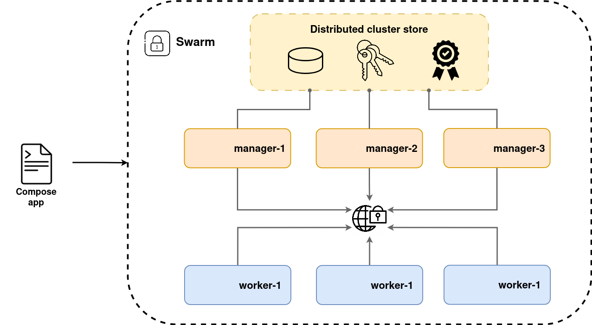
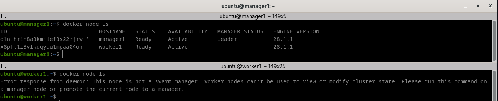
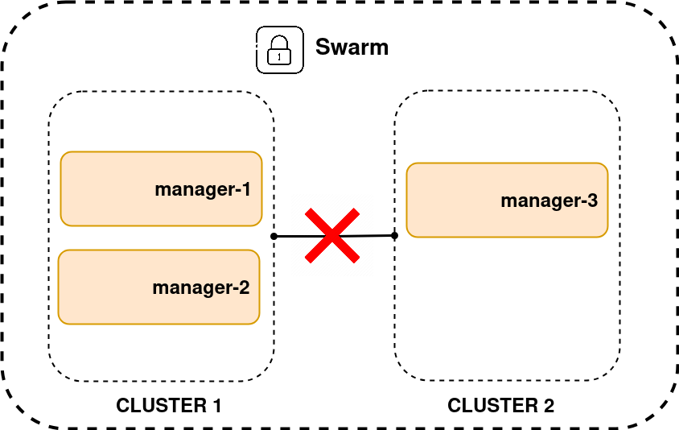
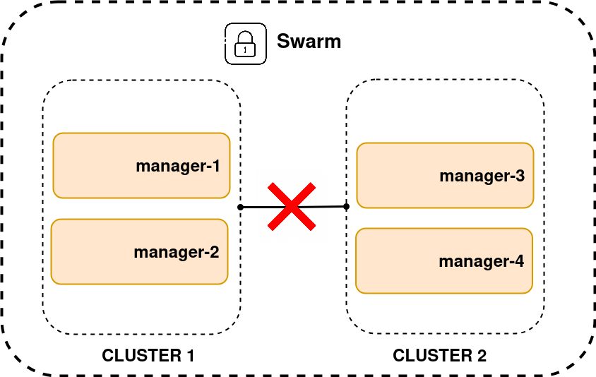

[__HOME__](../../README.md)

> [<- PREVIOUS CHAPTER](./6-compose.md) __|__ [NEXT CHAPTER ->](./8-stack.md)
---


## INDEX:


---

### Introduction

On the clustering front, Swarm groups one or more Docker nodes into a cluster.

With it you can get:
- Encrypted distributed cluster store: On which you can save secrets
- Encrypted networks: On which you enable your containers and clusters to communicate securely with each other
- Mutual TLS: To enable authentication between swarm nodes
- Secure cluster join tokens: To securely add new nodes to the swarm
- PKI: An encrypted Raft-based cluster store used internally by Swarm, including for managing secrets

We call these clusters _swarms_.

There are two types of nodes created inside a cluster which are:
- `manager`: Run the control plane services that maintain the state of the cluster and schedule user applications to workers
- `worker`: Run the user application

The swarm stores its state and configuration in an in-memory distributed database that replicates across all manager nodes. Swarm uses TLS to encrypt communications, authenticate nodes, and authorize roles.

- 

> On the orchestration front, Swarm makes it easy to deploy and manage container applications.

### Building a swarm

In this section, you'll build locally the following swarm cluster with 1 manager and 1 worker.

#### Pre requisites (Multipass)

Given that locally we only have our own computer and that Swarm orchestrates different computers to work together, it will be necessary to set up virtual machines to simulate each of the computers we will need.

To accomplish that you can use [Multipass](https://canonical.com/multipass/install).
```bash
# In case you don't have snap distributor execute the following command
# sudo apt install snapd
# If you had to install snapd, remember to include the snapd binaries in the PATH
# If you are working with ZSH, this can be done with the following command 
# `export PATH="$PATH:/snap/bin"`

sudo snap install multipass
```

#### Building your docker nodes

Once you have installed multipass we will need to create all the virtual machines that will sustain each of the nodes.

Each node will have the following specs:
- 2 CPU
- 40GB disk
- 4GB RAM

```bash
multipass launch docker --name manager1 --cpus 2 --disk 40G --memory 4G
multipass launch docker --name worker1 --cpus 2 --disk 40G --memory 4G
```

###### Troubleshooting

1. `error launch failed: multipass socket access denied`:
    - This error means that the socket used to allow your kernel to speak with multipass is protected. To give access to it you have to execute the following command `sudo chmod 666 /var/snap/multipass/common/multipass_socket`.
2. `launch failed: KVM support is not enabled on this machine.`   
    - The problem it will be that your BIOS doesn't have enabled virtualization.
    - This means that you will have to enter it to enable it

You can check if the virtual machines have been created is done with the following command:
```bash
multipass ls
Name                    State             IPv4             Image
manager1                Running           10.222.216.226   Ubuntu 24.04 LTS
                                          172.17.0.1
worker1                 Running           10.222.216.30    Ubuntu 24.04 LTS
                                          172.17.0.1
```

Lastly, you can check that if multipass have correctly created the VM connecting to it and checking if it has docker installed.

This can be done with the following commands:
```bash
multipass shell manager1
docker --version
Docker version 28.1.1, build 4eba377
exit
logout
```

#### Initializing a new swarm

The process of building a swarm is called `initializing` a swarm and it's a high-level process.

This is accomplished with the following actions:
1. Initialize the first manager
2. Join additional managers
3. Join workers

The docker engine has the following modes:
- `single-engine mode`: On which it runs regular containers
- `swarm-mode`: On which can receive orders to execute containers as a swarm

When a docker engine joins a swarm it enables the `swarm-mode`.

Following the high level description defined above we will start creating the first manager of the swarm. This action will be done inside the VM that will be the manager (this means that we will have to use the command `multipass shell manager1`) and execute the command `docker swarm init` adding the IP on which the VM that will serve as a manager is reachable.

> __NOTE__: We can identify the IP of the virtual machine using the command multipass ls and the port it will be `2377` which is the default port from docker to enable swarm communications

To accomplish this we will have to execute the following commands:
```bash
multipass shell manager1
docker swarm init \
    --advertise-addr 10.222.216.226:2377 \
    --listen-addr 10.222.216.226:2377
Swarm initialized: current node (d1nlhrih8a3kmjlef3s22rjrw) is now a manager.

To add a worker to this swarm, run the following command:

    docker swarm join --token SWMTKN-1-4wlq6le2gs765sio8u8v5lm19b4eekwq72nbk2925111ycat46-6garqnzdhojyzqk30p2l8fkhs 10.222.216.226:2377

To add a manager to this swarm, run 'docker swarm join-token manager' and follow the instructions.
```

You can check if the swarm has ben correctly created using this command:
```bash
docker node ls
ID                            HOSTNAME   STATUS    AVAILABILITY   MANAGER STATUS   ENGINE VERSION
d1nlhrih8a3kmjlef3s22rjrw *   manager1   Ready     Active         Leader           28.1.1
```

#### Joining workers into the swarm

To join workers into the swarm (or other managers) it will be needed to provide a token to the manager that verifies the node to enter the swarm.

This tokens can be shown using the following command:
```bash
# TOKEN TO GIVE TRANSFORM A VM INTO A WORKER NODE
docker swarm join-token worker
To add a worker to this swarm, run the following command:

    docker swarm join --token SWMTKN-1-4wlq6le2gs765sio8u8v5lm19b4eekwq72nbk2925111ycat46-6garqnzdhojyzqk30p2l8fkhs 10.222.216.226:2377

# TOKEN TO GIVE TRANSFORM A VM INTO A MANAGER NODE
docker swarm join-token manager
To add a manager to this swarm, run the following command:

    docker swarm join --token SWMTKN-1-4wlq6le2gs765sio8u8v5lm19b4eekwq72nbk2925111ycat46-6dacj1wyh8ovblkui4nlp2vdp 10.222.216.226:2377
```

> __NOTE__: This actions are done from the VM `manager1` 

Now its time to add the worker into the swarm. To accomplish this we will have to make the following:
```bash
multipass shell worker1
docker swarm join \
    --token SWMTKN-1-4wlq6le2gs765sio8u8v5lm19b4eekwq72nbk2925111ycat46-6garqnzdhojyzqk30p2l8fkhs 10.222.216.226:2377 \
    --advertise-addr 10.222.216.30:2337 \
    --listen-addr 10.222.216.30:2337
```

If the command has ended successfully you can check inside throw the manager (because the worker won't be able to see these details) using again the `docker node ls` command.

- 

In this image you can see that the `manager1` (upper terminal) is listing two nodes and the `worker1` (downer terminal) can't list any node.


### Notes about the swarm

#### Swarm manager high availability

Swarm clusters are highly available (HA), meaning one or more managers can fail, and the swarm will keep running.

This is accomplished with the manager roles `leader` and `follower`. These roles defines who of the managers can changes the state of the cluster. Meaning that he is allowed to scale, deploy, manage nodes and handle orchestration or scheduling.

> __NOTE__: Leader and follower is Raft terminology, and we use it because Swarm implements the [Raft consensus algorithm](https://raft.github.io/) to maintain a consistent cluster state across multiple highly-available managers.

However it has to be taken into account that there are needed to apply some practices to apply HA correctly which are:
1. Always deploy an odd number of managers
2. Don't deploy too many managers (3 or 5 is usually enough)
3. Spread managers across availability zones

#### Communication problems between clusters in a swarm

Consider the following scenario: we have a Swarm consisting of several managers distributed in two locations (or groups), and communication between them is lost.

- 

In this case, the worker nodes will continue to execute the tasks already assigned to them, so they will still be able to respond to user requests, as long as traffic continues to reach them.

However, managers that lose the majority (quorum) will not be able to make changes to the cluster state, such as scaling services or deploying new containers.

The group that retains the majority of managers (Raft quorum) will be the one that can:
1. Elect a valid leader
2. Continue to modify the cluster state (create/scale/update services).

The isolated group without quorum will enter read-only mode and will not be able to modify the cluster state.

If we take into account the above explanation we can correct why one of the practices to achieve HA is to have an odd number of managers.

- 

In the case of cluster isolation, neither side will be able to have a majority to define a valid leader and modify the status of its cluster.

---
> [<- PREVIOUS CHAPTER](./6-compose.md) __|__ [NEXT CHAPTER ->](./8-stack.md)