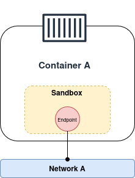

[__🧭 HOME__](../../README.md)

> [⬅️ PREVIOUS CHAPTER](./7-stack.md)
---

## INDEX:
- [Introduction](#introduction)  
  - [Docker networking theory](#docker-networking-theory)  
    - [The Container Network Model](#the-container-network-model)  
    - [Libnetwork](#libnetwork)  
    - [Driver](#driver)  
  - [Types of networks](#types-of-networks)  
    - [Bridge](#bridge)  
    - [Overlay](#overlay)  
  - [Trouble shooting](#trouble-shooting)

---

### Introduction

Docker networking is based on `libnetwork`, which is the reference implementation of an open-source architecture called the Container Network Model (CNM)

For a smooth out-of-the-box experience, Docker ships with everything you need for the most common networking requirements, including multi-host container-to-container networking and options for plugging into existing VLANs. However, the model is pluggable, and the ecosystem can extend Docker's networking capabilities via drivers that plug into libnetwork.

#### Docker networking theory

At the highest level, Docker networking is based on the following three components:
- __The container Network Model (CNM)__: Is the design specification and outlines the fundamental building blocks of a Docker network.
- __Libnetwork__: Is a real-world implementation of the CNM. It's open-sourced as part of the [Moby project](https://mobyproject.org) and used by Docker and other platforms
- __Drivers__: Extend the model by implementing specific network topologies such as VXLAN overlay network.

##### The Container Network Model

Everything starts with a design.

The design guide for Docker networking is the CNM that outlines the fundamental building blocks of a Docker network.

I recommend you read the specification document, but at a high level, it defines three building blocks:
- __Sandboxes__: Is an isolated network stack inside a container. It includes Ethernet interfaces, ports, routing tables, DNS configuration, and everything else you'd expect from a network stack,
- __Endpoints__: Are virtual network interfaces that look, smell, and feel like regular network interfaces. They connect sandboxes to networks
- __Networks__: Are virtual switches (usually software implementations of an 802.1d bridge). As such, they group together and isolate one or more endpoints that need to communicate.

> __NOTE__: It's also important to understand that endpoints behave exactly like regular network adapters, meaning you can only connect them to a single network. This is why Container A will need another Endpoint to connect to another network.

##### Libnetwork

Before Docker created libnetwork, it implemented all of its networking code inside the daemon. However, over time, the daemon became bloated and difficult for other projects to use. As a result, Docker removed the networking code from the daemon and refactored it as an external library called libnetwork based on the CNM design.

Today Docker implements all of its core networking in libnetwork.

##### Driver

Every network you create is owned by a driver, and the driver creates and manages everything about the network. For example, if you create an overlay network called __prod-fe-cuda__, Docker will invoke the overlay driver to create the network and its resources.

#### Types of networks

In the [previous] chapter(./8-stack.md#network) we had to configure the network in overlay mode. This implies that there are several types of networks.

The network types that exist are:
- __Bridge__: Allows connecting several containers within the same network, but only on the same host.
    - This is the default Docker network
    - In Linux, the bridge driver is based on the driver docker0
- __Overlay__: Allows you to connect several containers within the same network, even if they are on different nodes (i.e., hosts).

##### Trouble shooting

The following are several commands that can help in the inspection of a network.

- `docker network inspect <name-network>`: Checks the configuration of a network
- `docker port <container>`: Checks the exposed interface of a container

---
> [⬅️ PREVIOUS CHAPTER](./7-stack.md)