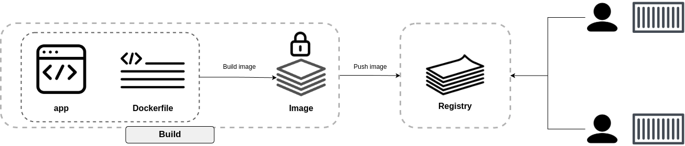
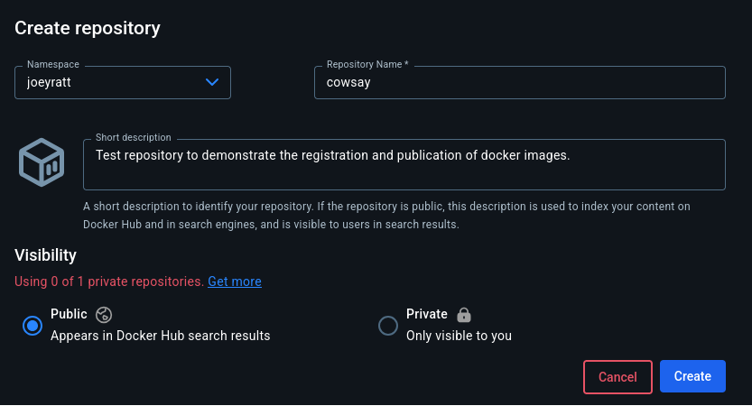

[__HOME__](../../README.md)

> [<- PREVIOUS CHAPTER](./4-containers.md) __|__ [NEXT CHAPTER ->](./6-compose.md)
---

## INDEX:
- [Containerize flow](#containerize-flow)
- [Publishing an image into the DockerHub](#publishing-an-image-into-the-dockerhub)
- [Technical stuff about build](#technical-stuff-about-build)
- [Keywords into the Dockerfile](#keywords-into-the-dockerfile)
- [Moving to production with multi-stage builds](#moving-to-production-with-multi-stage-builds)

---

## Containerize flow

Docker aims to make it easy to build, ship and run applications. We call this _containerization_ and the process looks like this:

1. Write your applications
2. Define a list of all dependencies
3. Create a Docker that tells Docker how to build and run the app
4. Build the app into an image
5. Push the image ot a registry (optional)
6. Run a container from the image

This flow can be summarized into the following diagram:



## Publishing an image into the DockerHub

Let's say we want to make the image we created in [the first exercise](../exercises/0-the-first-image/README.md) public, that is, we want everyone to be able to run cowsay.

To do this, we need to use a registry. There are several, but we are going to use a free one like [hub docker](https://hub.docker.com). In order to register our image in this repository we must first have an account.

Once the account has been generated, we must create a repository where the different cowsays images will be registered.



Once we have generated our repository we can go back to our original task, i.e. public cowsay image. To do this we need to log in to Docker Hub via `docker login`.

> NOTE: When executing this command, we will be shown the instructions to be able to log in.

Once logged in we must include a new tag on our existing image (in case it is not displayed with the `docker images` command, go back to cowsay's [exercise](../exercises/0-the-first-image/README.md) to recreate it).

Tags are necessary to publish images to a repository, as they define the account and the repository itself. In my case, if I were to push the cowsays image as is, I would publish the image to a repository called cowsay.

```bash
docker images
REPOSITORY   TAG                  IMAGE ID       CREATED        SIZE
cowsay       latest               dbdf27b44e96   14 hours ago   282MB
```

As the repository we created is called `cowsays` it should work as is, however... if we do a `push` we will see the following:

```bash
docker push cowsay:latest
The push refers to repository [docker.io/library/cowsay]
a73d74ee7120: Waiting 
1f4a3d643eb9: Waiting 
155ad54a8b28: Waiting 
ed39b113210b: Waiting 
push access denied, repository does not exist or may require authorization: server message: insufficient_scope: authorization failed
```

This is because the image we are posting is missing information in the tag, namely the account where it will be posted. If we go back to the previous image we can see that the account is `joeyratt`.

This means that we must generate a new tag over the existing image where all the information is included:
```bash
docker tag cowsay:latest joeyratt/cowsay:latter
```

After this action, we can publish the image via the `push` command.

```bash
docker push joeyratt/cowsay:latest
The push refers to repository [docker.io/joeyratt/cowsay]
1f4a3d643eb9: Pushed
155ad54a8b28: Pushed
ed39b113210b: Pushed
a73d74ee7120: Pushed
latter: digest: sha256:dbdf27b44e960394f4a5783c1dea13c37b98618c96b7d10dc7ab8cca92e1454d size: 855
```

After these steps we can say that we have published a docker image in your registry. We will be able to access this registry from any computer with an internet connection.

In order to test it we are going to delete all the images from our local repository and make a run of `joeyratt/cowsay:latest`, let's see what happens...

```bash
# Here we are checking that there is no images in our local repo
docker images
REPOSITORY   TAG       IMAGE ID   CREATED   SIZE
# Here we are downloading our published image in docker
docker run joeyratt/cowsay:latest
Unable to find image 'joeyratt/cowsay:latest' locally
latest: Pulling from joeyratt/cowsay
Digest: sha256:d821dbf36dbb3fbf8438a7a29933955e1366bde60dbbc60683c47c4ad90e9147
Status: Downloaded newer image for joeyratt/cowsay:latest
 _______________________________________
/ I hope your day is going well because \
\ mine is going phenomenal              /
 ---------------------------------------
        \   ^__^
         \  (oo)\_______
            (__)\       )\/\
                ||----w |
                ||     ||
```

## Technical stuff about build

Behind the scenes, Docker's build system has a client and server:
- Client: Buildx
- Server: BuildKit

Buildx is docker's latest and greatest build client. It's implemented as a CLI plugging and supports all the latest features of BuildKit, such as multi-stage build, multi-architecture images, advanced caching, and more.

If you point builx at a local builder, image builds will be done on your local machine. If you point it at a remote builder, such as Docker Build Cloud, builds will be done on remote infrastructure. When you run a docker build command, builx interprets the command and sends the build request to the selected builder. This includes the:
- Dockerfile
- Command line arguments
- Caching options
- Export options
- Build context (app and dependency list)

The builder performs the build and exports the image, while the buildx client reports on progress. Docker uses `docker-container` driver that uses QEMU to emulate target hardware. It usually works but can be slow.

You can use the docker build command to build images for multiple architectures including ones different from your local machine.

These builds can be performed locally or in the cloud. Both work with the standard `docker build` command and only require minimal backend configuration. Run the following command to list your current builders.

```bash
docker buildx ls
NAME/NODE     DRIVER/ENDPOINT   STATUS    BUILDKIT   PLATFORMS
default*      docker                                 
 \_ default    \_ default       running   v0.20.0    linux/amd64 (+3)
```

> Remember, a builder is an instance of BuildKit that will perform builds.

You can create more builders that serves the creation of images in concrete platforms. This can be done with the following command:

```bash
docker buildx create --driver=docker-container --name=container
```

These new builder will remain dormant until its been used or enabled.

In the following command it shows how to use this new builder and concrete in which architectures it will be build the image needed:
```bash
docker buildx build --builder=container \
    --platform=linux/amd64,linux/arm64 \
    -t joeyratt/cowsay:latest --push .
```

## Keywords into the Dockerfile

Now that tou've containerized the application let's take a closer look at how some of the machinery works.

The `docker build` command parses the Dockerfile one file at a time, starting from the top. You can insert comments by starting a line with the # character and the builder will ignore them.

All non-comment lines are called _instructions_ or _steps_ and take the format `<INSTRUCTION> <arguments>`. INstruction names are not case-sensitive, but it's common to write them in UPPERCASE to make them easier to read.

There are two times of instructions:
- Layers creators: These are the ones like `FROM`, `RUN`, `WORKDIR` and `WORKDIR`
- Metadata creators: `EXPOSE`, `ENV`, `CMD` and `ENTRYPOINT`

With the command history against any image you will see the instructions that created it:

```bash
docker history joeyratt/cowsay:latest
IMAGE          CREATED        CREATED BY                                      SIZE      COMMENT
d821dbf36dbb   15 hours ago   CMD ["phenomenal"]                              0B        buildkit.dockerfile.v0
<missing>      15 hours ago   ENTRYPOINT ["cowsay" "I hope your day is goi…   0B        buildkit.dockerfile.v0
<missing>      15 hours ago   ENV PATH=/usr/local/sbin:/usr/local/bin:/usr…   0B        buildkit.dockerfile.v0
<missing>      15 hours ago   RUN /bin/sh -c apt install -y cowsay # build…   54MB      buildkit.dockerfile.v0
<missing>      15 hours ago   RUN /bin/sh -c apt update # buildkit            19.6MB    buildkit.dockerfile.v0
<missing>      2 weeks ago    # debian.sh --arch 'amd64' out/ 'bookworm' '…   133MB     debuerreotype 0.15
```

The main keywords used in a docker file and its use are the following:
- `FROM`: Sets the base image for the container
- `RUN`: Executes a command inside the image during build
- `COPY`: Copies files from the host into the image
- `EXPOSE`: Declares a container's listening port (only documents it)
- `ENTRYPOINT`: Defines the main process of the container
- `CMD`: Provides default arguments for the container
- `LABEL`: Adds metadata to the image
- `ENV`: Sets environment variables inside the container
- `ONBUILD`: Triggers instructions only when the image is used as a base
- `HEALTHCHECK`: Defines a command to check if the container is still running correctly


## Moving to production with multi-stage builds

When it comes to container images... big is bad!

Because:
- It means slow
- Means moore potential vulnerabilities
- Larger attack surface

At a high, multi-stage builds use a single Dockerfile with multiple `FROM` instructions - each `FROM` instruction represents a new `build stage`. This allows you to have a stage where you do the heavy lifting of building the app inside a large image with compilers and other build tools, but then you have another stage where you copy the compiled app into a slim image for production.

Here is a docker files as an example:
```dockerfile
FROM golang:1.22.1-alpine AS base               # STAGE 0
WORKDIR /src
COPY go.mod go.sum .
RUN go mod download
COPY . .

FROM base AS build-client                       # STAGE 1
RUN go build -o /bin/client ./cmd/client

FROM base AS build-server                       # STAGE 2
RUN go build -o /bin/server ./cmd/server

FROM scratch AS prod                            # STAGE 3
COPY --from=build-client /bin/client /bin/
COPY --from=build-server /bin/server /bin/
ENTRYPOINT ["bin/server"]
```

Into each stage the following is been done:
1. __base__:  Builds an image with compilation tools
2. __build-client__: Compiles the client executable
3. __build-server__: Compiles the server executable
4. __prod__: Copies the client and server executables into a slim image

Each stage outputs an intermediate image that later stage can use. __However, Docker deletes them when the final stage its complete__. The builder will run the base stage first, then run the `build-client` and `build-server` stage in parallel, and finally run the `prod` stage.

It will always attempt to run stages in parallel, but it can only do this when no dependency exist. For example, the build-client and build-server stages depend on the base stage and cannot run until that stage completes (both start with _FROM base..._). However, the build-client and build-server can run in parallel because they don't depend on each other.

Anyway. The final production image is only 25 MB, much smaller than the 300MB+ base image pulled by the base stage to build and compile the app.


---
> [<- PREVIOUS CHAPTER](./4-containers.md) __|__ [NEXT CHAPTER ->](./6-compose.md)