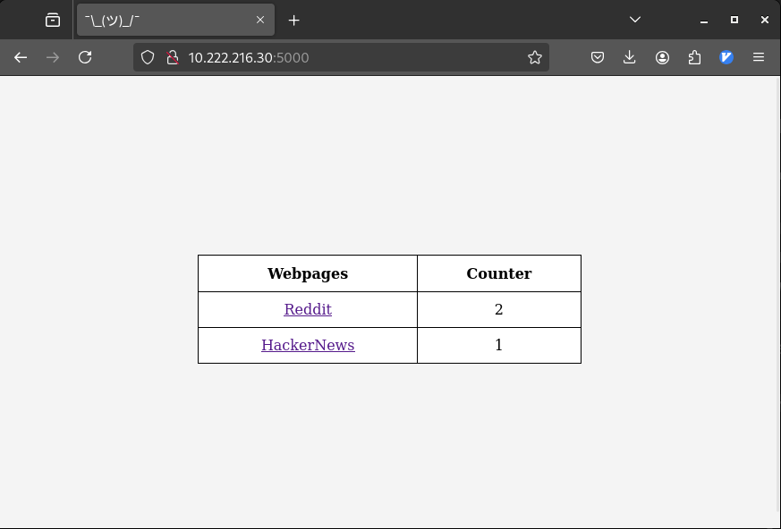

# Webpage in stack format

In this exercise, you will build the same solution done in the [exercise 4](../4-compose/README.md).

The main difference will be that the created solution will be done using `docker stack` instead of compose.

The redis service don't have to create multiple replicas.

> __NOTE__: To make this exercise you need to have a cluster of 2 worker nodes and 1 manager

## Solution

The docker compose created here has to be uploaded into the manager node created in multipass.

This can be done with the following commands:
```bash
# Getting inside the manager instance
multipass shell manager1

# Loading the compose file (in our case we will use nvim)
sudo apt install neovim
mkdir workspace
cd workspace
touch ./compose.yaml
nvim compose.yaml


# In this step load all compose configuration

docker stack deploy -c ./compose.yaml webpage
```

You can check if the service is been correctly created with the following prompt:
```bash
# Checking if the service is been created
docker stack ls
NAME      SERVICES
webpage   2         # <======== The 2 means that the app is running 2 services

# Checking all the replicas created in that concrete service
docker stack services webpage
ID             NAME               MODE         REPLICAS   IMAGE                           PORTS
8zi01zb4onq0   webpage_redis-db   replicated   1/1        redis/redis-stack:latest        
08k329ay08jx   webpage_webpage    replicated   4/4        joeyratt/webpage-redis:latest   *:5000->5001/tcp

# Checking all logs of the webpage service (here i want to check that the listening port matches with the one from the service)
docker service logs webpage_webpage

# REPLICA FROM THE WORKER NODE 2
webpage_webpage.2.jt69unk97xf0@worker2    |  * Serving Flask app 'src'
webpage_webpage.2.jt69unk97xf0@worker2    |  * Debug mode: off
webpage_webpage.2.jt69unk97xf0@worker2    | WARNING: This is a development server. Do not use it in a production deployment. Use a production WSGI server instead.
webpage_webpage.2.jt69unk97xf0@worker2    |  * Running on all addresses (0.0.0.0)
webpage_webpage.2.jt69unk97xf0@worker2    |  * Running on http://127.0.0.1:5001
webpage_webpage.2.jt69unk97xf0@worker2    |  * Running on http://172.18.0.4:5001
webpage_webpage.2.jt69unk97xf0@worker2    | Press CTRL+C to quit
<Snip>

# REPLICA FROM THE WORKER NODE 1
webpage_webpage.1.ccq7uwuspem5@worker1    |  * Serving Flask app 'src'
webpage_webpage.1.ccq7uwuspem5@worker1    |  * Debug mode: off
webpage_webpage.1.ccq7uwuspem5@worker1    | WARNING: This is a development server. Do not use it in a production deployment. Use a production WSGI server instead.
webpage_webpage.1.ccq7uwuspem5@worker1    |  * Running on all addresses (0.0.0.0)
webpage_webpage.1.ccq7uwuspem5@worker1    |  * Running on http://127.0.0.1:5001
webpage_webpage.1.ccq7uwuspem5@worker1    |  * Running on http://172.18.0.4:5001
webpage_webpage.1.ccq7uwuspem5@worker1    | Press CTRL+C to quit
webpage_webpage.1.ccq7uwuspem5@worker1    | 10.0.0.3 - - [17/May/2025 10:49:45] "POST /increment_counter/reddit HTTP/1.1" 200 -
<Snip>
```

> __NOTE__: Take into account that this prompt must be executed in the manager node

Finally, you can access the web page published in the cluster through the IP of one of the nodes and including port 5000.

```bash
# Checking the IPs from each node
multipass ls
Name                    State             IPv4             Image
manager1                Running           10.222.216.226   Ubuntu 24.04 LTS
                                          172.17.0.1
                                          172.18.0.1
worker1                 Running           10.222.216.30    Ubuntu 24.04 LTS
                                          172.17.0.1
                                          172.18.0.1
worker2                 Running           10.222.216.246   Ubuntu 24.04 LTS
                                          172.17.0.1
                                          172.18.0.1
```

Accessing the website:


