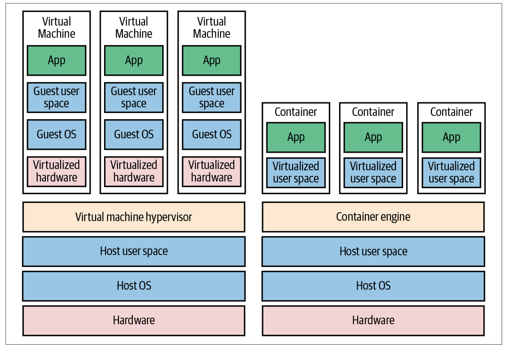

[__HOME__](../README.md)

> [GOTO NEXT >](./1_installation.md)
---
# Introduction

In this section we will introduce the concept of Docker and its main features.

#### The main topics that we will cover are:
- [Sharing without docker](#sharing-without-docker)
- [Sharing with docker](#sharing-with-docker)
- [Dockers vs Virtual Machines](#dockers-vs-virtual-machines)
- [Images vs Containers](#images-vs-containers)

---

## Sharing without docker

Dockers allows to __share a software project between different teams eliminating the need to prepare the environment where the code will be executed__.

For example, let's say we want to share a web page developed in node among our colleagues.

This project, surely, will need that the web page is in a node server with a concrete version, moreover, we can say that, in addition, it requires a database in PostgreeSQL in another concrete version and already with some concrete records.

As we can see, the execution of this program on another computer will __require an effort to adapt the system to the needs of the software__.

This system where the computer running the program must have a __very specific infrastructure__ can lead to the generation of errors since different computers must have a communication that will require many manual steps.

---

## Sharing with docker

Before going into detail, in a software project team there is usually the figure of developer and operations.

This operations figure is in charge of the following:
- Configure final servers
- Applying specific configurations on the equipment
- Deploy updates on the servers
- Consult the DEVs when an update requires additional configuration.

As we can see, through the use of dockers the operations figure disappears since dockers ends up offering a final image with all the configuration required by the server and, as the developers work directly with this image, the final result offered does not require additional work to deploy it in the final environment.

Docker brings to the table the concept of a container.

This __container consists of a portable machine with the software running__ and all the dependencies that it has, we can imagine in the above case a machine with the version of NodeJS and PostgreeSQL needed for the web page we want to share.

This container will be able to run on other computers in isolation, that is, the current configuration of the computer that will run the code will be independent because it will run in a virtualized and isolated environment.

The only thing that the computer will need to be able to run the container will be to have Docker.
- Virtualization software
- Makes developing and deploying applications much easier
- Packages application with all the necessary dependencies, configuration, system tools and runtime
- An standardized unit, that has everything the application needs to run

---

## Dockers vs Virtual Machines

Docker is a virtualization tool, however, it brings some key differences with virtual machines that have led to make it more popular.

Before going into detail about the key differences, it is necessary to clarify the layers that a computer has at software level.

These layers would be the following:
- Software: 
    - __OS Applications Layer__: Layer where the executed applications are located.
    - __OS Kernel__: Layer that communicates the applications with the hardware resources.
- Hardware: Hardware resources

After nuancing the different layers at the operating system level we can say that the key difference between dockers and a virtual machine is that Docker virtualizes the application layer and a virtual machine both.

This difference in virtualization implies that docker, when running the container itself, what it does is to communicate with the kernel of the machine itself, in isolation, in order to request the necessary resources with which it can run.

This small difference has its impact at a technical level since docker, unlike VM, will be more efficient and lighter, however, __it will need the container and the operating system kernel to be aligned, that is, the local machine will run a LINUX__.

The key differences would be as follows:

| DIFFERENCES |DOCKER|VIRTUAL MACHINE|
|---|---|---|
| SIZE IMAGE  | MB   | GB  |
| STARING MACHINE | Seconds | Minutes |
| COMPATIBLE | LINUX | All OS |

However, docker has done an update called __Docker desktop__ for Windows and Mac using Hypervisor layer (lightweight Linux distribution) that makes possible to run docker containers in these operative systems.

---

## Images vs Containers

**Docker Image**:
- A Docker image is an __immutable template containing the file system and configurations__ needed to run an application. It's a static snapshot of an application and its environment.
- Images are read-only and consist of layers representing the instructions in the Dockerfile used to create them. They serve as the base for creating containers.

**Docker Container**:
- A container is a __runnable instance of an image__. It's an isolated environment where the image runs.
- Containers are ephemeral and mutable, capable of being started, stopped, moved, and deleted. When a container runs, it adds a writeable layer on top of the immutable image, allowing the application inside to modify files and state during its execution.

In essence, a __Docker image is like a blueprint or recipe__, and a __container is the live instance__ where the application runs in an isolated and consistent environment.

When the instance is stopped the container is deleted.

---