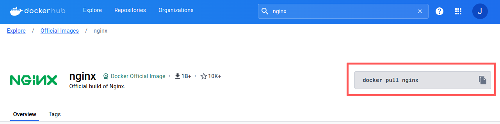
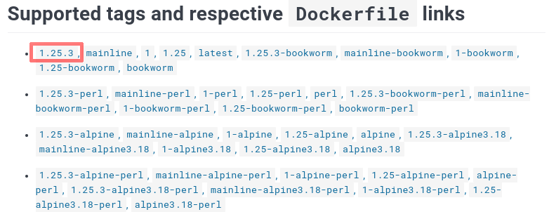
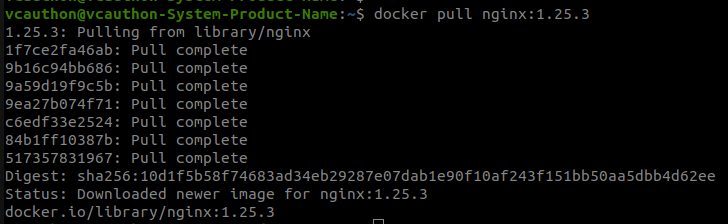
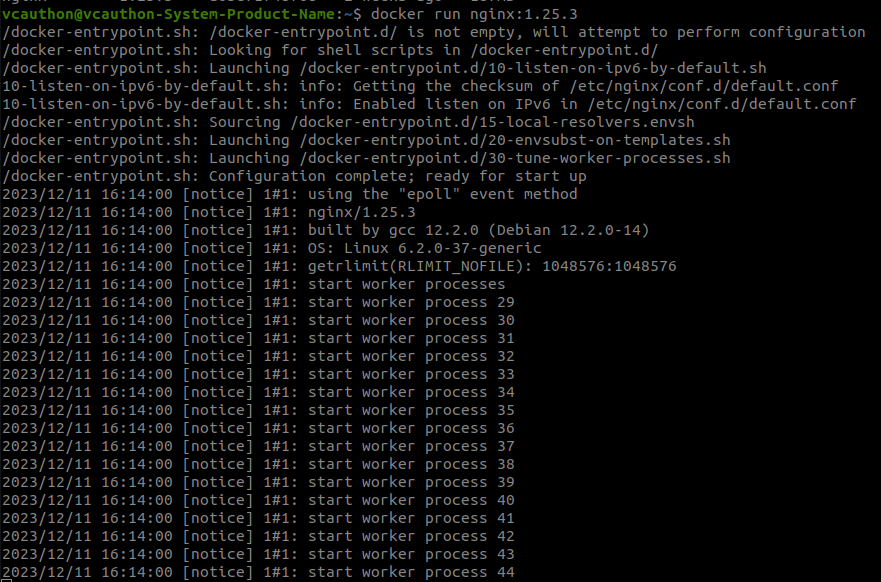
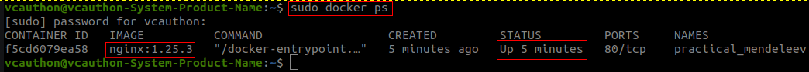

[__HOME__](../../README.md)

> [< GO BACK](./1_installation.md)&nbsp;&nbsp;&nbsp;&nbsp;&nbsp;&nbsp;&nbsp;&nbsp;&nbsp;&nbsp;&nbsp;&nbsp;&nbsp;&nbsp;&nbsp;&nbsp;&nbsp;&nbsp;&nbsp;&nbsp;&nbsp;&nbsp;&nbsp;&nbsp;&nbsp;&nbsp;&nbsp;&nbsp;&nbsp;&nbsp;&nbsp;&nbsp;&nbsp;&nbsp;&nbsp;&nbsp;&nbsp;&nbsp;&nbsp;&nbsp;&nbsp;&nbsp;&nbsp;&nbsp;&nbsp;&nbsp;&nbsp;&nbsp;&nbsp;&nbsp;&nbsp;&nbsp;&nbsp;&nbsp;&nbsp;&nbsp;&nbsp;&nbsp;&nbsp;&nbsp;&nbsp;&nbsp;&nbsp;&nbsp;&nbsp;&nbsp;&nbsp;&nbsp;&nbsp;&nbsp;&nbsp;&nbsp;&nbsp;&nbsp;&nbsp;&nbsp;&nbsp;&nbsp;&nbsp;&nbsp;&nbsp;&nbsp;&nbsp;&nbsp;&nbsp;&nbsp;&nbsp;&nbsp;&nbsp;&nbsp;&nbsp;&nbsp;&nbsp;&nbsp;&nbsp;&nbsp;&nbsp;&nbsp;&nbsp;&nbsp;&nbsp;&nbsp;&nbsp;&nbsp;&nbsp;&nbsp;&nbsp;&nbsp;&nbsp;&nbsp;&nbsp;&nbsp;&nbsp;&nbsp;&nbsp;&nbsp;&nbsp;&nbsp;&nbsp;&nbsp;&nbsp;&nbsp;&nbsp;&nbsp;&nbsp;&nbsp;&nbsp;&nbsp;&nbsp;&nbsp;&nbsp;&nbsp;&nbsp;&nbsp;&nbsp;&nbsp;&nbsp;&nbsp;&nbsp;&nbsp;&nbsp;&nbsp;&nbsp;&nbsp;&nbsp;&nbsp;&nbsp;&nbsp;&nbsp;&nbsp;&nbsp;&nbsp;&nbsp;&nbsp;&nbsp;&nbsp;&nbsp;&nbsp;&nbsp;&nbsp;&nbsp;&nbsp;&nbsp;&nbsp;&nbsp;&nbsp;&nbsp;&nbsp;&nbsp;&nbsp;&nbsp;&nbsp;&nbsp;&nbsp;&nbsp;&nbsp;&nbsp;&nbsp;&nbsp;&nbsp;&nbsp;&nbsp;&nbsp;&nbsp;&nbsp;&nbsp;&nbsp;&nbsp;&nbsp;&nbsp;&nbsp;&nbsp;&nbsp;&nbsp;&nbsp;&nbsp;&nbsp;&nbsp;&nbsp;&nbsp;&nbsp;&nbsp;&nbsp;&nbsp;&nbsp;&nbsp;&nbsp;&nbsp;&nbsp;&nbsp;&nbsp;&nbsp;&nbsp;&nbsp;&nbsp;&nbsp;[GOTO NEXT >](./3_containers.md)
---
# Introduction

In this section we will talk about the image repository and how to download an image from it.

#### The main topics that we will cover are:
- [Docker registry](#docker-registry)
- [Downloading an image](#downloading-an-image)
- [Creating a container](#creating-a-container)

---

## Docker registry

It's a repository of __docker images__ artifacts and there exist a __public__ and __private__ (ECR).

> __NOTE__: A registry isn't a repository. Instead is a collection of repositories (and a repository is a collection of images with different versions).

These images are created by the software developers themselves, for example, if we need to create a container that has a PostgresSQL server we can download an image officially generated by the Postgres team (and with this image generate our container).

All these images are stored in [DockerHub](https://hub.docker.com/), an official docker space where you can find all the images and containers.

The published images are maintained by the official teams, this means that the images will be versioned by __TAG__.

---

## Downloading an image

As an example, we are going to download an nginx image from the DockerHub repository with which to generate a container.

The container will be obtained by creating a web server and, through the computer's browser, confirming that we have access to the web page published by that server (located in a container).

> Take into account that in the image repository there is all the documentation you need about that image. For example __¿How you have to set the network?¿Which environment variables exists?__

Therefore we are going to perform the following steps:
1. Access [DockerHub](https://hub.docker.com/).
2. Look for the official nginx image.
    - 
3. Select a concrete version of the image (__recommended practice__)
    - 
4. We access the terminal and execute a pull of the image:version
    - `docker pull nginx:1.25.3`.
    - NOTE: If we make a pull without the version (`docker pull nginx`) the last version will be downloaded.
5. We should have a result similar to this.
    - 
6. We can see the downloaded images locally with the following command
    - `docker images`.

---

## Creating a container

Para crear un contenedor debemos instanciar una imagen, para ello hay que ejecutar el siguiente comando.

```bash
# Example
docker run {name-img}:{tag-version}
# Starting nginx server
docker run nginx:1.25.3
```

Sabemos que se está ejecutando por que en consola se nos mostrara los logs del propio servidor.



Es más, podemos confirmar que la imagen esta instanciada por que tendremos un contenedor nuevo en el equipo del cual podemos confirmar que está en ejecución.


