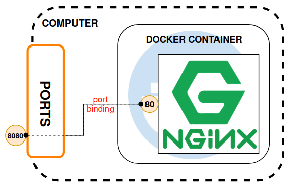
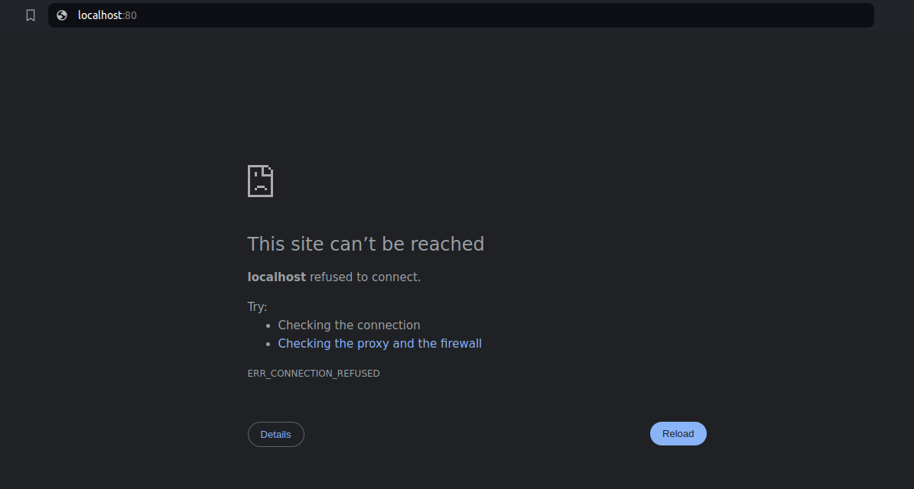
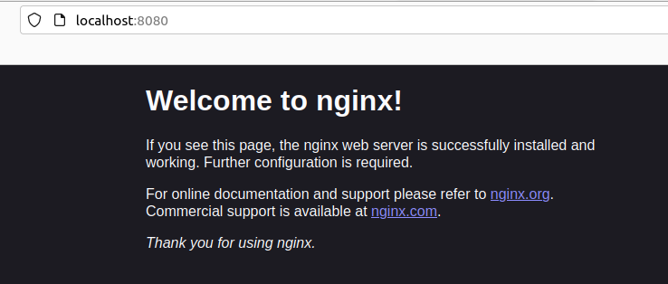

[__HOME__](../README.md)

> [< GO BACK](./2_image_repository.md)&nbsp;&nbsp;&nbsp;&nbsp;&nbsp;&nbsp;&nbsp;&nbsp;&nbsp;&nbsp;&nbsp;&nbsp;&nbsp;&nbsp;&nbsp;&nbsp;&nbsp;&nbsp;&nbsp;&nbsp;&nbsp;&nbsp;&nbsp;&nbsp;&nbsp;&nbsp;&nbsp;&nbsp;&nbsp;&nbsp;&nbsp;&nbsp;&nbsp;&nbsp;&nbsp;&nbsp;&nbsp;&nbsp;&nbsp;&nbsp;&nbsp;&nbsp;&nbsp;&nbsp;&nbsp;&nbsp;&nbsp;&nbsp;&nbsp;&nbsp;&nbsp;&nbsp;&nbsp;&nbsp;&nbsp;&nbsp;&nbsp;&nbsp;&nbsp;&nbsp;&nbsp;&nbsp;&nbsp;&nbsp;&nbsp;&nbsp;&nbsp;&nbsp;&nbsp;&nbsp;&nbsp;&nbsp;&nbsp;&nbsp;&nbsp;&nbsp;&nbsp;&nbsp;&nbsp;&nbsp;&nbsp;&nbsp;&nbsp;&nbsp;&nbsp;&nbsp;&nbsp;&nbsp;&nbsp;&nbsp;&nbsp;&nbsp;&nbsp;&nbsp;&nbsp;&nbsp;&nbsp;&nbsp;&nbsp;&nbsp;&nbsp;&nbsp;&nbsp;&nbsp;&nbsp;&nbsp;&nbsp;&nbsp;&nbsp;&nbsp;&nbsp;&nbsp;&nbsp;&nbsp;&nbsp;&nbsp;&nbsp;&nbsp;&nbsp;&nbsp;&nbsp;&nbsp;&nbsp;&nbsp;&nbsp;&nbsp;&nbsp;&nbsp;&nbsp;&nbsp;&nbsp;&nbsp;&nbsp;&nbsp;&nbsp;&nbsp;&nbsp;&nbsp;&nbsp;&nbsp;&nbsp;&nbsp;&nbsp;&nbsp;&nbsp;&nbsp;&nbsp;&nbsp;&nbsp;&nbsp;&nbsp;&nbsp;&nbsp;&nbsp;&nbsp;&nbsp;&nbsp;&nbsp;&nbsp;&nbsp;&nbsp;&nbsp;&nbsp;&nbsp;&nbsp;&nbsp;&nbsp;&nbsp;&nbsp;&nbsp;&nbsp;&nbsp;&nbsp;&nbsp;&nbsp;&nbsp;&nbsp;&nbsp;&nbsp;&nbsp;&nbsp;&nbsp;&nbsp;&nbsp;&nbsp;&nbsp;&nbsp;&nbsp;&nbsp;&nbsp;&nbsp;&nbsp;&nbsp;&nbsp;&nbsp;&nbsp;&nbsp;&nbsp;&nbsp;&nbsp;&nbsp;&nbsp;&nbsp;&nbsp;&nbsp;&nbsp;&nbsp;&nbsp;&nbsp;&nbsp;&nbsp;&nbsp;&nbsp;&nbsp;&nbsp;&nbsp;[GOTO NEXT >](./4_images.md)
---
# Introduction

In this section we will talk about the containers and how to manage them.

#### The main topics that we will cover are:
- [Container isolation](#container-isolation)
- [Example of port binding](#example-of-port-binding)
- [Setting a port binding](#setting-a-port-binding)
- [Containers repository](#containers-repository)
- [Starting a stopped container](#starting-a-stopped-container)
- [Data persistence](#data-persistence)

---

## Container isolation

Containers are isolated from the other containers and outside of your local machine.

This means that we can have multiple containers of the same service with different version on the same local machine.

But also means that they cannot...
- Request data to other containers
- Get information from the internet

However, you can modify the container configuration to perform what is known as port binding to bind a specific port on the machine to a specific port in the container.

---

## Example of port binding

The term port binding means to bind the port of a virtual environment to the port of the host itself, so that this port ends up being the gateway to the container itself.

To develop this concept a little, let's imagine that we want to give access to the `nginx` web server that we have created in point 2 of this guide. This server, inside the container, __will be listening for calls coming from port 80__, however, outside the host where the container is located, there is no access to it.

We could solve this if we bind port 80 of the Docker container to any port of the machine (for example port 8080), so that when an external machine accesses port 8080 of the machine it is really accessing port 80 of the container, that is, the nginx server.

>  It is necessary to consider that if, from the own equipment, we acceded to the port 80 of docker (from the own navigator) we would not accede to the port 80 of docker, but, to the own host where, as we have not made port binding, we would not see anything.  
> 

---

## Setting a port binding

To perform the port binding we can do it through terminal or through docker-compose. For this case we are going to see it directly through the terminal.

To bind a virtual port with the host port we must do it when creating the container with `docker run` indicating the command `-p` or `--publish` next to the docker port with the final host port.

Format: `docker run -p {HOST_PORT}:{CONTAINER_PORT}`.
Example with nginx: `docker run -p 8080:80`.

If we run a `docker ps` we can see, next to the raised container, the port to which it is bound:
- Creating a container setting the port binding:
    - 
- Accessing to the container through a local port:
    - 

> The standard says that, although it is not mandatory, __you should set the same docker port with the real host port__.

---

## Containers repository

Each time we initialize an image we generate a new container and when we stop the container we terminate it. Although it may not look like it (since when performing a `docker ps` we do not see everything we have stopped), the containers still exist and can be reused.

To be able to visualize these containers we must execute including to `docker -ps` the `-a` or `--all` flag.

An example of the execution of this command:

[Listing all containers](static/listing_ended_containers.png)

---

## Starting a stopped container

As long as they exist, containers can be initialized again through the `docker start {CONTAINER_ID}` command.

For example, let's say we want to initialize the container we have stopped in the repository, i.e. this one here:

.

With this in mind we should run the command `docker start f5cd6079ea58` and.... confirmed!

However, and to confirm that the container is working and we can access it, we are going to assign port 8081 to confirm that we can access both the container that is running and this second one.

To do this, we would run the command `docker start f5cd6079ea58 -p 8081:80`.

---

## Data persistence

There is something to know that there are no data persistence in a container, this means that each time me reset those containers all the data and configuration are gone for good.

