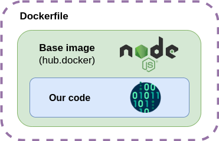
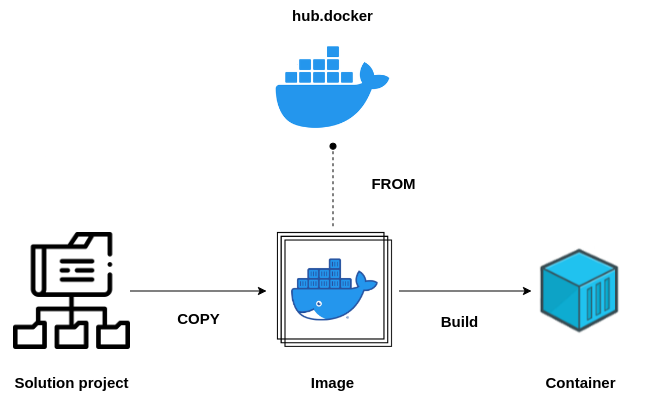

[__HOME__](../README.md)

> [< GO BACK](./3_containers.md)&nbsp;&nbsp;&nbsp;&nbsp;&nbsp;&nbsp;&nbsp;&nbsp;&nbsp;&nbsp;&nbsp;&nbsp;&nbsp;&nbsp;&nbsp;&nbsp;&nbsp;&nbsp;&nbsp;&nbsp;&nbsp;&nbsp;&nbsp;&nbsp;&nbsp;&nbsp;&nbsp;&nbsp;&nbsp;&nbsp;&nbsp;&nbsp;&nbsp;&nbsp;&nbsp;&nbsp;&nbsp;&nbsp;&nbsp;&nbsp;&nbsp;&nbsp;&nbsp;&nbsp;&nbsp;&nbsp;&nbsp;&nbsp;&nbsp;&nbsp;&nbsp;&nbsp;&nbsp;&nbsp;&nbsp;&nbsp;&nbsp;&nbsp;&nbsp;&nbsp;&nbsp;&nbsp;&nbsp;&nbsp;&nbsp;&nbsp;&nbsp;&nbsp;&nbsp;&nbsp;&nbsp;&nbsp;&nbsp;&nbsp;&nbsp;&nbsp;&nbsp;&nbsp;&nbsp;&nbsp;&nbsp;&nbsp;&nbsp;&nbsp;&nbsp;&nbsp;&nbsp;&nbsp;&nbsp;&nbsp;&nbsp;&nbsp;&nbsp;&nbsp;&nbsp;&nbsp;&nbsp;&nbsp;&nbsp;&nbsp;&nbsp;&nbsp;&nbsp;&nbsp;&nbsp;&nbsp;&nbsp;&nbsp;&nbsp;&nbsp;&nbsp;&nbsp;&nbsp;&nbsp;&nbsp;&nbsp;&nbsp;&nbsp;&nbsp;&nbsp;&nbsp;&nbsp;&nbsp;&nbsp;&nbsp;&nbsp;&nbsp;&nbsp;&nbsp;&nbsp;&nbsp;&nbsp;&nbsp;&nbsp;&nbsp;&nbsp;&nbsp;&nbsp;&nbsp;&nbsp;&nbsp;&nbsp;&nbsp;&nbsp;&nbsp;&nbsp;&nbsp;&nbsp;&nbsp;&nbsp;&nbsp;&nbsp;&nbsp;&nbsp;&nbsp;&nbsp;&nbsp;&nbsp;&nbsp;&nbsp;&nbsp;&nbsp;&nbsp;&nbsp;&nbsp;&nbsp;&nbsp;&nbsp;&nbsp;&nbsp;&nbsp;&nbsp;&nbsp;&nbsp;&nbsp;&nbsp;&nbsp;&nbsp;&nbsp;&nbsp;&nbsp;&nbsp;&nbsp;&nbsp;&nbsp;&nbsp;&nbsp;&nbsp;&nbsp;&nbsp;&nbsp;&nbsp;&nbsp;&nbsp;&nbsp;&nbsp;&nbsp;&nbsp;&nbsp;&nbsp;&nbsp;&nbsp;&nbsp;&nbsp;&nbsp;&nbsp;&nbsp;&nbsp;&nbsp;&nbsp;&nbsp;&nbsp;&nbsp;&nbsp;&nbsp;&nbsp;[GOTO NEXT >](./5_debugging.md)
---
# Introduction

In this section we will talk about the creation of Docker images.

#### The main topics that we will cover are:
- [What is a Dockerfile?](#what-is-a-dockerfile)
- [Dockerfile Instructions](#dockerfile-instructions)
- [Example of a Dockerfile](#example-of-a-dockerfile)
- [Creating the Image](#creating-the-image)
- [Creating Docker Images](#creating-docker-images)

---

## Creating Docker Images

So far, we have created containers that ceased to be useful as we did not include the code of our particular solution. To address this, we need to introduce an additional concept: the `Dockerfile`.

---

## What is a Dockerfile?

A `Dockerfile` is a definition used by Docker to create our image. This image can then be used to create the containers we need.

It is important to note that the images we build can be based on a base image. That is, we can indicate that our image should be generated from another image that already provides the basic services needed for our solution to run.



This is what makes Docker so efficient, as an image can be lightweight and multiple layers of images can be generated, ultimately forming a single container.

For example, suppose our solution consists of a web page that, when accessed, displays a basic message. This web page will need to run on a server, such as Node.

Thus, we could say that the base image on which we will build our image would be a Node image (which we can obtain from [hub.docker](https://hub.docker.com/_/node)).



---

## Dockerfile Instructions

The instructions that can be defined in a Dockerfile are the following:
- `FROM`: Specifies the base image from which our Docker image is built.
- `COPY`: Copies files and directories from the build context into the container's filesystem.
- `WORKDIR`: Sets the working directory for commands like `RUN`, `CMD`, `ENTRYPOINT`, `COPY`, and `ADD` in the Dockerfile.
- `RUN`: Executes commands during the image build process, commonly used for installing software.
- `CMD`: Defines the default command that will be executed when a container is started from the image. Only the last `CMD` command will take effect.

---

## Example of a Dockerfile

Let's imagine we have a project with a very simple web page that uses Node.

The web page project has the following structure:
- __src__:
    - `server.js`
- `package.json`

Let's assume that `server.js` is the JavaScript code that publishes the web page and `package.json` contains the libraries that Node needs to work with the web page.

At the root of the project, we would include the `Dockerfile` with the following format:

Here is an example of a Dockerfile:
```Dockerfile
FROM node:19-alpine

COPY package.json /app/
COPY src /app/

WORKDIR /app

RUN npm install
CMD ['node', 'server.js']
```

---

## Creating the Image

To create the image, we need to use the `docker build` command, which allows optional parameters to fully define the image.

The parameters are as follows:
- `-t NAME:VERSION` or `--tag NAME:VERSION`: Defines the name and version of the image.
- `-f Dockerfile` or `--file Dockerfile`: Indicates the name of the file where the image definition is located (default is Dockerfile).
- `--build-arg ARG=value`: Allows passing build arguments that can be used in the Dockerfile.
- `--no-cache`: Builds the image without using the cache, forcing the update of each step in the Dockerfile.
- `--pull`: Always tries to download the latest version of the base image.
- `--rm`: Removes intermediate containers after a successful build. By default, this is enabled.
- `--squash`: Combines all layers into one to reduce the size of the resulting image.
- `--cache-from image[:tag]`: Specifies images to use as cache to optimize build times.
- `--network network`: Specifies the network configuration to use during image construction.
- `--add-host host:IP`: Adds a custom entry to the `/etc/hosts` file.
- `--platform platform`: Specifies the platform for which the image will be built, useful for multi-platform images.

The last parameter to indicate in the build ends up being the project directory.

An example of execution would be the following:
- `docker build -t my-app:1.0 .`