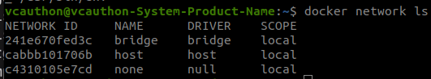
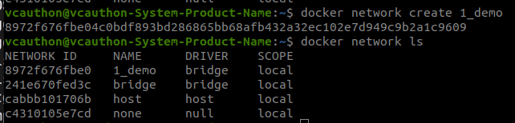
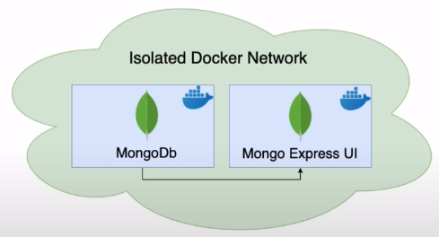
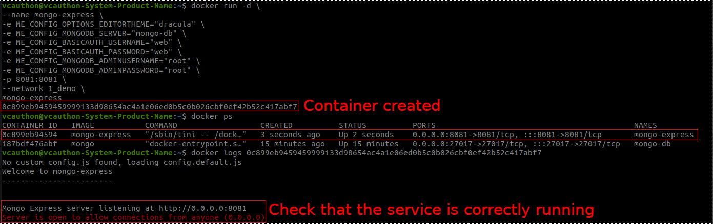
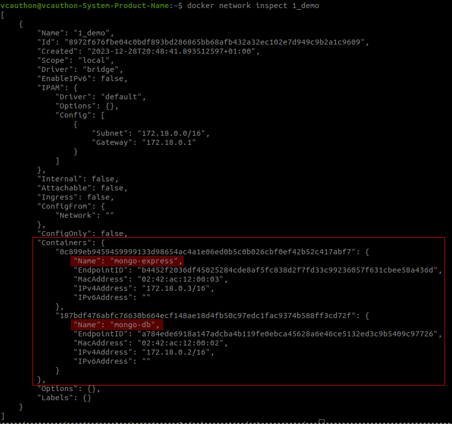

[__HOME__](../../README.md)

> [<- PREVIOUS CHAPTER](./5-debugging.md) __|__ [NEXT CHAPTER ->](./7-docker-compose.md)
---
# Introduction

In this section we will talk about the creation of Docker networks.

#### The main topics that we will cover are:
- [Docker network](#docker-network)
- [Example of networks](#example-of-networks)

---

## Docker network

First we have to understand that docker has a private network system where you can publish the containers you create. When creating a container you can indicate if you want it to be part of a specific network.

However, and before going into detail, indicate that docker already has some networks created by default which can be listed through the following command:
- `docker network ls`



However, we can also create our own networks, for example:
- `docker network create {NAME}` !



---

## Example of networks

Let's say we want to set up a network to manage a noSQL database.

The images we will use will be:
- mongo: The container will correspond to the database.
- mongo-express: We will use this container as UI to work with the DB.



> NOTE: Although this network interconnects the different containers, they will not use IP:PORTS to communicate with each other (this saves us learning about subnet). The containers will recognize each other by their own name.

We will start by creating a mongo container, however, we will include the following additional parameters.

```bash
docker run
-d \
--network 1_demo \
--name mongo-db \
-e MONGO_INITDB_ROOT_USERNAME=root \
-e MONGO_INITDB_ROOT_PASSWORD=root \
-p 27017:27017 \
mongo
```


The most important parameters are:
- `-e`: Sets all environment variables to create a root user (these can be [here](https://hub.docker.com/_/mongo))
- `--network`: Creates the container inside a network

Let's run the command to create the container and confirm that it has been created correctly.

[Checking container](static/network_mongo_container.png)

Now let's create a mongon-express container inside the same network where the mongo container is located (and with the necessary parameters so that both services know how to communicate).

```bash
docker run -d \
--name mongo-express
-e ME_CONFIG_OPTIONS_EDITORTHEME="dracula" \
-e ME_CONFIG_MONGODB_SERVER="mongo-db" \ -e ME_CONFIG_MONGODB_SERVER="mongo-db" \
-e ME_CONFIG_BASICAUTH_USERNAME="web" \e ME_CONFIG_BASICAUTH_USERNAME="web" \
-e ME_CONFIG_BASICAUTH_PASSWORD="web" \ -e ME_CONFIG_BASICAUTH_PASSWORD="web" \ \
-e ME_CONFIG_MONGODB_ADMINUSERNAME="root" \
-e ME_CONFIG_MONGODB_ADMINPASSWORD="root" \
-p 8081:8081 \
--network 1_demo \
mongo-express
```

Run the command and confirm that the container has been created.




We can confirm that both containers are on the same network by running the command `docker network inspect 1_demo`.

It will display the following:



---
