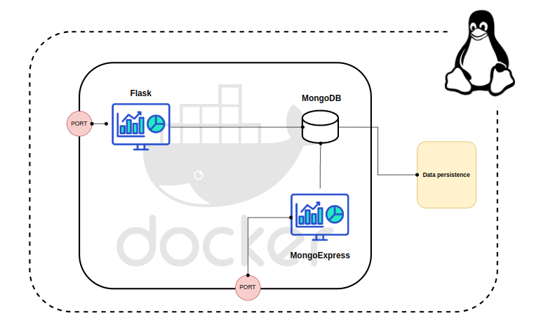

[__HOME__](../../../README.md)

> [GOTO NEXT>](../2-data-analysis/README.md)
---

# HTTP server

### Objective 

The objective of this project is to create a web page in node.js which works with a database in mongo DB and, to work with mongo db by UI (instead of using commands) MongoExpress will be installed.

### Steps:
1. Create an api using flask to handle post and get http methods
2. The index of the http server will be an html form [with the following format](./src/my-app/templates/form.html)
3. All forms received will be save in a MongoDB database.
4. Enables mongo express so that the user can access, via web, to the mongo DB.
5. Use docker-compose to handle the interactions between services
6. Enable some data persistence system in mongoDB, so that no data is lost when the container is deleted.