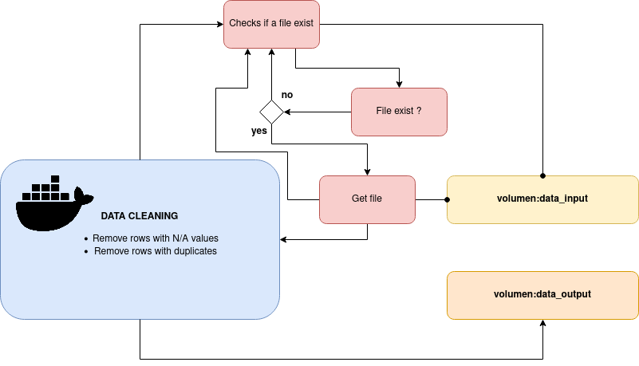

[__HOME__](../../../README.md)

> [<- PREVIOUS EXERCISE](../1-http-server/README.md) __|__ [NEXT EXERCISE ->](../2-data-visualization/README.md)
---
## Data Analysis with Pandas in Docker

### Objective
Create a Docker container that runs a Python script using the Pandas library for data analysis.

### Steps:
1. **Create a Python Script**: Write a Python script (`data_analysis.py`) that uses Pandas to read a data file and perform basic analysis (e.g., summary statistics, filtering).
2. **Dockerfile**: Create a Dockerfile to build a Python environment with Pandas.
3. **Build the Docker Image**: Run the command `docker build -t pandas-analysis .` to build your Docker image.
4. **Run the Container**: Use Docker volumes to mount your data file into the container and run your analysis.
5. **Analyze the Output**: Check the output of your script for the analysis results.
